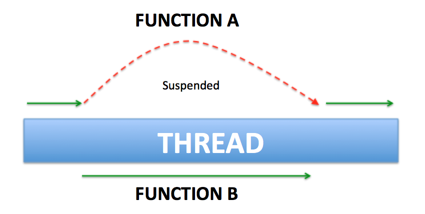

:memo: <span style="color:orange">ANDROID_ADVANCED_001_THREADING_&_KOTLIN_COROUTINE</span>

# THREADING & KOTLIN COROUTINE


## Table of Content

- [THREADING \& KOTLIN COROUTINE](#threading--kotlin-coroutine)
  - [Table of Content](#table-of-content)
  - [I. Lập trình bất đồng bộ](#i-lập-trình-bất-đồng-bộ)
    - [1. Lập trình đồng bộ (Synchronous)](#1-lập-trình-đồng-bộ-synchronous)
    - [2. Lập trình bất đồng bộ (Asynchronous)](#2-lập-trình-bất-đồng-bộ-asynchronous)
  - [II. Xử lý bất đồng bộ](#ii-xử-lý-bất-đồng-bộ)
    - [1. Thread](#1-thread)
    - [2. Kotlin coroutine](#2-kotlin-coroutine)
    - [3. So sánh](#3-so-sánh)
  - [III. Blocking và Function](#iii-blocking-và-function)
    - [1. Blocking](#1-blocking)
    - [2. Non-blocking](#2-non-blocking)
    - [3. Normal function - suspend function](#3-normal-function---suspend-function)
      - [1. Normal function](#1-normal-function)
      - [2. Suspend function](#2-suspend-function)
  - [IV. Coroutine scope, Job, Dispatcher](#iv-coroutine-scope-job-dispatcher)
    - [1. Coroutine scope](#1-coroutine-scope)
      - [1. GlobalScope](#1-globalscope)
      - [2. CoroutineScope](#2-coroutinescope)
      - [3. ViewModelScope](#3-viewmodelscope)
      - [4. LifecycleScope](#4-lifecyclescope)
    - [2. Job](#2-job)
    - [3. Dispatcher](#3-dispatcher)
      - [1. Dispatchers.Main](#1-dispatchersmain)
      - [2. Dispatchers.IO](#2-dispatchersio)
      - [3. Dispatchers.Default](#3-dispatchersdefault)
      - [4. Dispatchers.Unconfined](#4-dispatchersunconfined)
  - [V. Launch, async, await](#v-launch-async-await)
    - [1. Launch](#1-launch)
    - [2. Async](#2-async)
  - [I. Lập trình bất đồng bộ](#i-lập-trình-bất-đồng-bộ-1)
  - [II. Các kỹ thuật lập trình bất đồng bộ](#ii-các-kỹ-thuật-lập-trình-bất-đồng-bộ)
  - [III. Blocking và Function](#iii-blocking-và-function-1)
  - [IV. Coroutine scope, Job, Dispatcher](#iv-coroutine-scope-job-dispatcher-1)
  - [V. Launch, async, await](#v-launch-async-await-1)

## I. Lập trình bất đồng bộ

### 1. Lập trình đồng bộ (Synchronous)

> Là cách lập trình mà các hoạt động của chương trình sẽ được thực hiện tuần tự. Trong 1 thời điểm chỉ 1 tác vụ được thực hiện, các tác vụ tiếp theo phải chờ tác vụ hiện tại hoàn tất.


- Như hình trên, có tất cả 7 hoạt động --> nếu ta quy định mỗi hoạt động là 1 function thì ta có 7 function.

``` java
  function PourCoffee(){ //Rót cà phê
    console.log('Rót cà phê');
  }
  function FryEggsAsync(){ //chiên trứng
    console.log('Chiên trứng');
  }
  PourCoffee(); //hành động 1 rót cà phê
  FryEggsAsync(); //hành động 2 chiên trứng
  ....
  //hành động 3
  //hành động 4
  //hành động 5
  //hành động 6
  //hành động 7
  ```

- **Ưu điểm**: Các hoạt động xảy ra tuần tự nên có thể dễ quản lý, dễ debug và phát hiện vấn đề khi xảy ra lỗi.

- **Nhược điểm**: Nếu thời gian chạy các hoạt động đồng bộ xảy ra quá dài thì UI sẽ bị lock (đứng chương trình) do UI và các hoạt động đồng bộ cùng thuộc về 1 thread.
  - Ví dụ: Đơn giản nhất là khi làm việc với api lấy danh sách users từ database hay từ file. Trong trường hợp data quá lớn thì việc api này sẽ trả về rất lâu (thời gian chờ lâu). Nếu lập trình đồng bộ (synchronous) thì chương trình sẽ bị đứng (block UI) vì phải đợi gọi xong api thì khi đó thread duy nhất UI mới được giải phóng và làm việc khác.

### 2. Lập trình bất đồng bộ (Asynchronous)

> Là cách lập trình cho phép các hoạt động thực hiện không theo tuần tự. Có thể các đoạn code ở dưới chạy trước đoạn code viết ở phía trên(bất đồng bộ), các hoạt động không phải đợi lẫn nhau do chạy trên các thread khác nhau.


- **Ưu điểm:** Bởi vì không bị block thread và các hoạt động có thể không phải đợi nhau nên khi xử lý các tác vụ có thời gian thực hiện lâu không bị đứng chương trình, đem lại trải nghiệm người dùng tốt.
- **Nhược điểm:** Bởi vì các hoạt động thực hiện không theo thứ tự nên ta phải quản lý các hành động này một cách cẩn thận.
  - Ví dụ như khi xử lý hành động submit form, đầu tiên phải validate dữ liệu, sau đó mới tới phần xử lý. Nếu như quản lý không tốt phần bất đồng bộ có thể dẫn tới: Phần xử lý chạy trước cả phần validate dữ liệu ---> có thể gây ra lỗi nghiêm trọng.

:bulb: Trong Android được chia làm 2 luồng chính là Main Thread (UI Thread) và Worker Thread.

- Main Thread có nhiệm vụ xử lý tác vụ liên quan đến UI như hiển thị hình ảnh chữ viết,...
- Worker Thread xử lý các tác vụ nặng tốn thời gian, tài nguyên như đọc ghi files, request network, tính toán,... và cập nhật kết quả trên UI Thread để tránh hiện tượng "Application Not Responding" (hay ANR) nếu Main Thread phải xử lý các tác vụ nặng đó.


## II. Xử lý bất đồng bộ

### 1. Thread

- **Thread** là một đơn vị cơ bản của CPU để thực thi các tác vụ. Mỗi **Thread** có thể thực thi một chuỗi lệnh độc lập và có bộ nhớ riêng.
- **Thread** thường được sử dụng cho các tác vụ đồng thời hoặc song song, nơi mỗi tác vụ chạy độc lập trên các CPU hoặc lõi CPU khác nhau.

:warning: Cái giá phải trả khi sử dụng Thread là khá đắt.

- Việc tạo luồng tốn kém vì có khá nhiều công việc liên quan:

  - Một khối bộ nhớ lớn phải được phân bổ và khởi tạo cho ngăn xếp luồng.
  - Cần phải thực hiện các lệnh gọi hệ thống để tạo/đăng ký luồng gốc với hệ điều hành máy chủ.
  - Cần phải tạo, khởi tạo và thêm các mô tả vào các cấu trúc dữ liệu nội bộ của JVM.

- Việc này tốn kém theo nghĩa là luồng sẽ ràng buộc các tài nguyên miễn là nó còn hoạt động; ví dụ: ngăn xếp luồng, bất kỳ đối tượng nào có thể truy cập được từ ngăn xếp, các mô tả luồng JVM, các mô tả luồng gốc của hệ điều hành.

- Chi phí của tất cả những thứ này tùy thuộc vào nền tảng cụ thể, nhưng chúng không hề rẻ trên bất kỳ nền tảng Java nào.

```java
fun main() {
    // Tạo một thread mới
    val myThread = Thread {
        for (i in 1..5) {
            println("Thread is running: $i")
            // Dừng thread trong 500ms
            Thread.sleep(500)
        }
    }

    // Bắt đầu chạy thread
    myThread.start()

    // Thực hiện một số công việc trong main thread
    for (i in 1..5) {
        println("Main thread is doing work: $i")
        // Dừng main thread trong 300ms
        Thread.sleep(300)
    }

    // Chờ thread kết thúc
    myThread.join()

    println("Main thread has finished.")
}
```

### 2. Kotlin coroutine

> Coroutines là 1 thuật toán có khả năng dừng (suspend) và tiếp tục (resume) việc thực thi code nằm trong nó mà không làm cho thread bị block.


- Về mặt khái niệm: tương tự như 1 luồng, nó cần 1 đoạn code để chạy và đoạn code này hoạt động đồng thời với các đoạn code còn lại.
- Coroutine không bị ràng buộc bởi 1 luồng cụ thể. Nó có thể tạm dừng thực thi trong một luồng và tiếp tục trong một luồng khác.

```java
import kotlinx.coroutines.*

fun main() = runBlocking {
    // Bắt đầu một coroutine trong CoroutineScope
    launch {
        delay(1000)  // Dừng coroutine trong 1 giây
        println("Coroutine is running!")
    }

    // Thực hiện một số công việc trong coroutine chính
    println("Main coroutine is doing work")
    delay(500)  // Dừng trong 0.5 giây
    println("Main coroutine is still running")
    
    // Đợi coroutine con hoàn tất
    delay(1500)
    println("Main coroutine has finished.")
}
```

- Giải thích:
  - runBlocking tạo ra một coroutine mới và làm cho luồng hiện tại (main thread) chờ cho đến khi tất cả các coroutine trong scope hoàn tất. Đây là cách hữu ích để chạy các coroutine trong các hàm chính.
  - launch tạo ra một coroutine con trong scope của runBlocking.
  - delay để dừng cả coroutine chính và coroutine con, cho phép chúng ta thấy thứ tự thực thi.

### 3. So sánh

- Coroutine giống như light-weight thread. Nhưng nó không phải là thread.
- Nó giống thread ở chỗ là các coroutine có thể chạy song song, đợi nhau và trao đổi dữ liệu với nhau.
- Sự khác biệt lớn nhất so với thread là coroutine rất rẻ, gần như là hàng free, chúng ta có thể chạy hàng nghìn coroutine mà gần như không ảnh hưởng lớn đến performance.  
- Một thread có thể chạy nhiều coroutine.
- Coroutine không phải lúc nào cũng chạy trên background thread, chúng cũng có thể chạy trên main thread.

## III. Blocking và Function

### 1. Blocking

- Luồng hiện tại sẽ phải đợi (hoặc "chặn") cho đến khi một tác vụ hoàn thành.
- Hệ thống chỉ có thể thực hiện một tác vụ mỗi luồng một lúc (trừ khi bạn sử dụng nhiều luồng).
- **Đồng bộ**: Các **thao tác blocking thường là đồng bộ**, có nghĩa là chương trình sẽ đợi tác vụ hoàn thành rồi mới tiếp tục với dòng mã tiếp theo.

```java
fun blockingFunction() {
    println("Blocking start")
    Thread.sleep(1000)  // Dừng luồng trong 1 giây
    println("Blocking end")
}

fun main() {
    println("Before calling blockingFunction")
    blockingFunction()  // Chặn luồng chính
    println("After calling blockingFunction")
}

// Output:
// Before calling blockingFunction
// Blocking start
// Blocking end
// After calling blockingFunction

```

### 2. Non-blocking

- Trái ngược lại cách chạy tuần tự trong khối Block, thì trong khối Non-Blocking các dòng lệnh không nhất thiết phải lúc nào cũng phải thực hiện một cách tuần tự (sequential) và đồng bộ (synchronous) với nhau.

- Các dòng lệnh phía sau được chạy ngay sau khi dòng lệnh phía trước được gọi mà không cần đợi cho tới khi dòng lệnh phía trước chạy xong.
  
- Các thao tác non-blocking thường là bất đồng bộ.

```java
import kotlinx.coroutines.*

fun main() = runBlocking {
    println("Before calling nonBlockingFunction")
    launch { nonBlockingFunction() }  // Chạy non-blocking trên coroutine khác
    println("After calling nonBlockingFunction")
}

suspend fun nonBlockingFunction() {
    println("Non-blocking start")
    delay(1000)  // Không chặn, chỉ dừng coroutine trong 1 giây
    println("Non-blocking end")
}

// Output:
// Before calling nonBlockingFunction
// After calling nonBlockingFunction
// Non-blocking start
// Non-blocking end

```

- Non-blocking nhưng không cần phải dựa vào việc dùng nhiều thread. Một thread chạy nhiều coroutine cũng có thể chạy được mô hình non-blocking.

### 3. Normal function - suspend function

#### 1. Normal function

```java
fun printMessage(message: String) {
    println(message)
}

fun main() {
    printMessage("Hello, Kotlin!")   // Output: Hello, Kotlin!
    printMessage("Welcome to normal functions!") // Output: Welcome to normal functions!
}

```


- Thread đó phải chạy xong function A rồi mới đến functionB.

```java
fun normalFunction() {
    println("Normal function called")
}

fun anotherNormalFunction() {
    normalFunction() // Gọi từ một normal function khác
}
```

- Không có từ khóa `suspend`.
- Có thể được gọi từ bất kỳ hàm nào khác, kể cả normal function và suspend function.
- Không yêu cầu bất kỳ ngữ cảnh đặc biệt nào như coroutine để gọi, vì chúng không có khả năng tạm dừng và tiếp tục một cách bất đồng bộ.

#### 2. Suspend function

```java
suspend fun suspendFunction() {
    println("Suspend function start")
    delay(1000)  // Dừng coroutine trong 1 giây mà không chặn luồng
    println("Suspend function end")
}

fun main() = runBlocking {
    println("Before calling suspendFunction")
    suspendFunction()  // Gọi từ coroutine
    println("After calling suspendFunction")
}

// Output: 
// Before calling suspendFunction
// Suspend function start
// Suspend function end
// After calling suspendFunction

```



- Suspend function cho phép ta làm được điều vi diệu hơn. Đó là suspend function có khả năng ngừng hay gián đoạn việc thực thi một tát (trạng thái ngừng là trạng thái suspend) và có thể tiếp tục thực thi lại khi cần thiết.
- functionA bị gián đoạn để functionB chạy và sau khi functionB chạy xong thì function A tiếp tục chạy tiếp.

- Trong ví dụ:
  - suspendFunction() dừng 1 giây trong coroutine mà không chặn luồng chính.
  - delay(1000) chỉ dừng coroutine trong 1 giây, nhưng không chặn toàn bộ luồng, vì đây là một hàm suspend.

```java
suspend fun suspendFunction() {
    println("Suspend function called")
}

fun normalFunctionWithCoroutine() {
    GlobalScope.launch {  // Tạo một coroutine để gọi suspend function
        suspendFunction()
    }
}
```

- Có từ khóa `suspend`.
- Chỉ có thể được gọi từ một suspend function khác hoặc bên trong một coroutine.

## IV. Coroutine scope, Job, Dispatcher

### 1. Coroutine scope

> Coroutine scope cung cấp một ngữ cảnh xác định (context) để coroutine chạy, đảm bảo rằng các coroutine chỉ tồn tại trong phạm vi mà chúng được khởi tạo.

- Khi Scope bị hủy, tất cả các coroutine trong Scope đó cũng sẽ bị hủy theo.
- Việc này giúp tối ưu tài nguyên và tránh rò rỉ bộ nhớ, đồng thời quản lý vòng đời của coroutine hiệu quả, đồng bộ.

#### 1. GlobalScope

- Là một Coroutine Scope có phạm vi toàn cục và sẽ tồn tại suốt vòng đời của ứng dụng.
- Các coroutine trong `GlobalScope` không có bất kỳ ràng buộc nào với lifecycle của một thành phần cụ thể (như activity).

```java
GlobalScope.launch {
    // Tác vụ chạy trong toàn bộ vòng đời của ứng dụng
}
```

- Sử dụng cho các tác vụ dài hạn, nhưng có nguy cơ dẫn đến rò rỉ bộ nhớ nếu không được quản lý cẩn thận.

#### 2. CoroutineScope

- CoroutineScope là phạm vi coroutine linh hoạt, có thể được sử dụng với các tác vụ có vòng đời cụ thể.
- Để tạo một CoroutineScope tùy chỉnh, cần truyền vào một `Job` hoặc một `CoroutineContext`.

```java
val customScope = CoroutineScope(Dispatchers.Main + Job())

customScope.launch {
    // Các coroutine chạy trong customScope
}
```

#### 3. ViewModelScope

- Là một coroutine scope dành riêng cho ViewModel trong Android, được cung cấp bởi thư viện AndroidX.
- Các coroutine trong `ViewModelScope` sẽ tự động bị hủy khi ViewModel bị hủy.

```java
class MyViewModel : ViewModel() {
    fun fetchData() {
        viewModelScope.launch {
            // Tác vụ coroutine sẽ tự động bị hủy khi ViewModel bị hủy
        }
    }
}

```

#### 4. LifecycleScope

- Là một coroutine scope dành riêng cho Android components hỗ trợ lifecycle, như `Activity` và `Fragment`.
- Các coroutine trong `LifecycleScope` có thể bị hủy hoặc tạm dừng tùy thuộc vào trạng thái của lifecycle.

```java
class MyFragment : Fragment() {
    override fun onViewCreated(view: View, savedInstanceState: Bundle?) {
        super.onViewCreated(view, savedInstanceState)
        
        viewLifecycleOwner.lifecycleScope.launch {
            // Coroutine này sẽ bị hủy khi lifecycle của fragment ở trạng thái DESTROYED
        }
    }
}
```

### 2. Job

- Là 1 element trong `CoroutineContext` nắm giữ thông tin về lifecycle của coroutine.
- Mỗi coroutine sẽ tạo một Job tương ứng để theo dõi trạng thái (như đang hoạt động, đã hoàn thành, hoặc đã bị hủy). Dưới đây là các thao tác cơ bản với Job:
  - Khởi tạo Job: Khi bạn khởi chạy một coroutine (với launch hoặc async), nó sẽ trả về một Job. Bạn có thể dùng Job này để theo dõi trạng thái của coroutine.
  - Hủy bỏ Job: Bạn có thể gọi cancel() để dừng coroutine bất cứ lúc nào. Điều này rất hữu ích để tránh lãng phí tài nguyên khi coroutine không còn cần thiết nữa (như khi người dùng rời khỏi màn hình).
  - Kiểm tra trạng thái Job: Job cung cấp các thuộc tính isActive, isCancelled, và isCompleted để kiểm tra trạng thái hiện tại của coroutine.

```java
fun main() {
    val job = GlobalScope.launch {
        // Coroutine bắt đầu thực hiện tác vụ
        delay(1000) 
        println("Task completed")
    }

    Thread.sleep(500)
    job.cancel()  // Hủy coroutine sau 500ms
    println("Job is cancelled: ${job.isCancelled}") // In ra trạng thái của job
}
// Job is cancelled: true

```

``` java
fun main() = runBlocking {
    val job = launch {
        repeat(10) { i ->
            println("Run $i")
            delay(500L)
        }
    }
    delay(1300L) // Đợi một khoảng thời gian
    println("Cancel")
    job.cancel() // Hủy coroutine
    println("Coroutine was canceled")
}
```

### 3. Dispatcher

- Là 1 element của CoroutineCotext : xác định luồng mà coroutine đó sẽ chạy. Nó giống như một bộ điều phối, giúp bạn chọn luồng thực thi cho coroutine.

#### 1. Dispatchers.Main

- Sử dụng trong các ứng dụng Android, giúp chạy coroutine trên luồng chính (Main thread).
- Thường được dùng để cập nhật giao diện người dùng sau khi một tác vụ không đồng bộ hoàn thành.

#### 2. Dispatchers.IO

- Dùng cho các tác vụ I/O như đọc và ghi file, truy cập cơ sở dữ liệu, hoặc gọi API mạng.
- `Dispatchers.IO` được tối ưu hóa cho các tác vụ I/O và sử dụng một nhóm luồng lớn hơn để xử lý nhiều yêu cầu đồng thời mà không gây tắc nghẽn.

#### 3. Dispatchers.Default

- Sử dụng khi chạy các tác vụ nặng, có thể tiêu tốn nhiều tài nguyên CPU (như xử lý dữ liệu, tính toán phức tạp).
- `Dispatchers.Default` tận dụng một nhóm luồng (`thread pool`) phù hợp với số lượng lõi của CPU.

#### 4. Dispatchers.Unconfined

- Dispatchers.Unconfined không giới hạn luồng thực thi, và coroutine sẽ chạy trên luồng nơi nó được gọi. Thường thì coroutine sẽ tiếp tục trên luồng khác khi nó bị đình chỉ.

```java
import kotlinx.coroutines.*

fun main() {
    // Tạo một CoroutineScope
    val scope = CoroutineScope(Dispatchers.Unconfined)

    // Khởi động một coroutine
    scope.launch {
        println("Start coroutine in thread: ${Thread.currentThread().name}")

        delay(1000)  // Giả lập một tác vụ bất đồng bộ

        println("Resume coroutine in thread: ${Thread.currentThread().name}")
    }

    // Chờ một chút để thấy kết quả
    Thread.sleep(1500)
    println("Main thread has finished.")
}
// Start coroutine in thread: main
// Resume coroutine in thread: ForkJoinPool.commonPool-worker-1
// Main thread has finished.

```

## V. Launch, async, await

### 1. Launch

> Là một phương thức dùng để khởi chạy một coroutine mới mà không trả về giá trị.

- Đây là lựa chọn phù hợp cho các tác vụ không yêu cầu kết quả trả về, hoặc khi bạn không cần lấy dữ liệu từ coroutine sau khi hoàn thành.
- `launch` trả về một đối tượng `Job`, cho phép bạn hủy hoặc theo dõi trạng thái của coroutine.

```java
fun main() = runBlocking {
    val job = launch {
        delay(1000L)
        println("completed!")
    }

    println("waiting...")
    job.join() // Chờ job hoàn thành
    println("Finished")
}
```

### 2. Async

- `async` cũng khởi chạy một coroutine mới, nhưng điểm khác biệt là nó trả về một `Deferred<T>`, là một `Job` với kết quả (giá trị trả về) của coroutine.
- `async` thường được sử dụng khi cần thực hiện các tác vụ song song và muốn lấy kết quả của các tác vụ đó, ví dụ call API song song.
- Để nhận kết quả từ `async`, cần sử dụng từ khóa `await`.
  - `await` là một phương thức dùng để lấy kết quả từ `Deferred` (kết quả trả về của `async`).
  - Khi gọi `await`, nó sẽ tạm dừng coroutine cho đến khi `Deferred` hoàn thành và trả về kết quả.
  - `await` chỉ có thể được gọi trên một `Deferred` và cần được gọi trong một `suspend function` hoặc một coroutine.

```java
fun main() = runBlocking {
    val deferred = async {
        // Tác vụ trong coroutine
        delay(1000L)
        "Kết quả từ async"
    }

    println("Đang chờ async...")
    val result = deferred.await() // Chờ và nhận kết quả từ async
    println("Kết quả nhận được: $result")
}
```
=======
  - [II. Các kỹ thuật lập trình bất đồng bộ](#ii-các-kỹ-thuật-lập-trình-bất-đồng-bộ)
  - [III. Blocking và Function](#iii-blocking-và-function)
  - [IV. Coroutine scope, Job, Dispatcher](#iv-coroutine-scope-job-dispatcher)
  - [V. Launch, async, await](#v-launch-async-await)

## I. Lập trình bất đồng bộ


## II. Các kỹ thuật lập trình bất đồng bộ


## III. Blocking và Function


## IV. Coroutine scope, Job, Dispatcher


## V. Launch, async, await

>>>>>>> dc98ce8a631d59728390fa1f09e56f1905c10ad5
