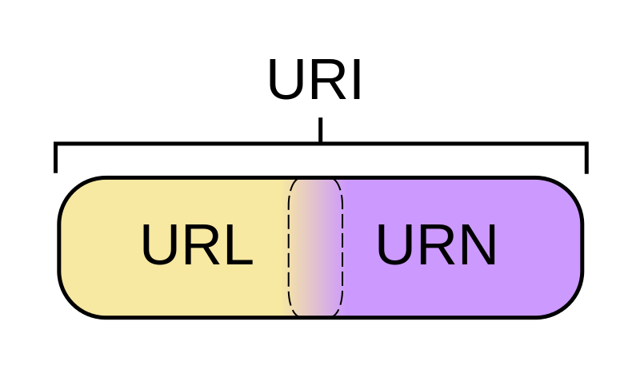

:memo: <span style="color:orange">ANDROID_ADVANCED_003_NETWORKING_&_API</span>

# NETWORKING & API


## Table of Content

- [NETWORKING \& API](#networking--api)
  - [Table of Content](#table-of-content)
  - [I. Networking overview](#i-networking-overview)
    - [1. Kiến trúc Client - Server](#1-kiến-trúc-client---server)
    - [2. Giao thức HTTP/HTTPS](#2-giao-thức-httphttps)
      - [1. HTTP (Hypertext Transfer Protocol)](#1-http-hypertext-transfer-protocol)
        - [Quy trình hoạt động](#quy-trình-hoạt-động)
      - [2. HTTPS (HTTP Secure)](#2-https-http-secure)
        - [Quy trình hoạt động của HTTPS](#quy-trình-hoạt-động-của-https)
      - [So sánh HTTP và HTTPS](#so-sánh-http-và-https)
    - [3. IP, Port, URL, và DNS](#3-ip-port-url-và-dns)
      - [1. IP (Internet Protocol)](#1-ip-internet-protocol)
      - [2. Port](#2-port)
      - [3. URL (Uniform Resource Locator)](#3-url-uniform-resource-locator)
      - [4. DNS (Domain Name System)](#4-dns-domain-name-system)
    - [4. Phân biệt Uri và Url](#4-phân-biệt-uri-và-url)
  - [II. RESTful API](#ii-restful-api)
    - [1. API là gì](#1-api-là-gì)
    - [2. RESTful API là gì? Nguyên tắc của RESTful API?](#2-restful-api-là-gì-nguyên-tắc-của-restful-api)
    - [3.  Các phương thức HTTP trong RESTful API](#3--các-phương-thức-http-trong-restful-api)
    - [4.  Cấu trúc một API endpoint: Base URL, Endpoint, Query Parameters, Path Parameters](#4--cấu-trúc-một-api-endpoint-base-url-endpoint-query-parameters-path-parameters)
    - [5. Request: Header, Body, Method](#5-request-header-body-method)
      - [1. Request Line](#1-request-line)
      - [2. Headers](#2-headers)
      - [3. Body](#3-body)
    - [6. Response: Status Code, Body](#6-response-status-code-body)
    - [7. JSON và cách nó được sử dụng trong RESTful API](#7-json-và-cách-nó-được-sử-dụng-trong-restful-api)
  - [III. Cài đặt và tìm hiểu cách sử dụng của curl và Postman](#iii-cài-đặt-và-tìm-hiểu-cách-sử-dụng-của-curl-và-postman)

## I. Networking overview

### 1. Kiến trúc Client - Server

> Mô hình Client Server, hay kiến ​​trúc máy chủ-máy khách, là một khung ứng dụng nhằm phân chia nhiệm vụ giữa máy chủ và máy khách.

- Máy khách gửi yêu cầu đến một chương trình khác để truy cập dịch vụ do máy chủ cung cấp.
- Máy chủ sẽ chạy một hoặc nhiều chương trình chia sẻ tài nguyên và phân phối công việc giữa các máy khách.
- Cả máy chủ và máy khách đều nằm trong cùng một hệ thống hoặc giao tiếp qua mạng máy tính hoặc Internet.
- Ví dụ: Web Server (máy chủ Web): Người dùng nhập địa chỉ trang Web vào trình duyệt trên máy tính để truy cập. Yêu cầu này được gửi tới máy chủ Web bởi máy khách. Sau đó, máy chủ Web sẽ gửi lại toàn bộ nội dung trang Web về máy khách ban đầu.


- Máy khách và máy chủ giao tiếp với nhau thông qua một giao thức.

:bulb: Giao thức là một tập hợp các quy tắc mà cả máy chủ và máy khách đều phải tuân theo. Hiện nay, có một số giao thức phổ biến là HTTPS, TCP/IP, FTP,...

- **Các máy khách đều cần phải tuân theo giao thức của máy chủ.**

- Nếu yêu cấp của máy khách hợp lệ và được chấp nhận, máy chủ sẽ tìm kiếm mọi thông tin dữ liệu cần thiết và phản hồi lại cho máy khách. 
- Máy chủ luôn trong trạng thái sẵn sàng, nên khi máy khách gửi yêu cầu và nếu được chấp nhận, máy chủ sẽ trả kết quả về hầu như là ngay lập tức.
- Tóm lại một cách ngắn gọn về cách hoạt động của mô hình client server như sau:
  - Đầu tiên, khách hàng gửi yêu cầu thông qua các thiết bị hỗ trợ mạng
  - Sau đó, máy chủ mạng chấp nhận và xử lý yêu cầu từ người dùng
  - Cuối cùng, máy chủ sẽ gửi phản hồi cho máy khách.

### 2. Giao thức HTTP/HTTPS

#### 1. HTTP (Hypertext Transfer Protocol)  

> HTTP là giao thức truyền tải siêu văn bản, được sử dụng để giao tiếp giữa trình duyệt web (client) và máy chủ web (server).

- Đây là một giao thức phi trạng thái, hoạt động theo mô hình **yêu cầu - phản hồi (request-response)**. Mỗi yêu cầu đều độc lập, server không lưu trạng thái của client.
- **Port mặc định:** Sử dụng cổng 80.
- **Không an toàn:** Dữ liệu truyền giữa client và server không được mã hóa, dễ bị đánh cắp hoặc nghe lén.

##### Quy trình hoạt động  

1. **Client** gửi yêu cầu (request) đến server thông qua URL (Uniform Resource Locator).  
2. **Server** xử lý yêu cầu, gửi phản hồi (response) chứa tài nguyên (như HTML, CSS, JS) hoặc mã trạng thái HTTP.

---

#### 2. HTTPS (HTTP Secure)  

> HTTPS là phiên bản bảo mật của HTTP, kết hợp với giao thức bảo mật **SSL/TLS** để mã hóa dữ liệu. Nó đảm bảo tính bảo mật, toàn vẹn, và xác thực trong giao tiếp web.

- **An toàn hơn:** Dữ liệu được mã hóa, tránh bị đánh cắp hoặc nghe lén.  
- **Port mặc định:** Sử dụng cổng 443.  
- **Xác thực:** Đảm bảo server là đáng tin cậy nhờ các chứng chỉ số (SSL/TLS Certificate).

##### Quy trình hoạt động của HTTPS
  
1. **Handshaking:**  
   - Client kết nối đến server, yêu cầu chứng chỉ số.  
   - Server gửi chứng chỉ SSL/TLS cho client.  
2. **Xác thực:**  
   - Client kiểm tra chứng chỉ và tạo khóa phiên (session key).  
3. **Mã hóa:**  
   - Tất cả dữ liệu trao đổi sau đó được mã hóa, chỉ client và server mới có thể giải mã.

---

#### So sánh HTTP và HTTPS  

| **Tiêu chí**      | **HTTP**                 | **HTTPS**                              |
| ----------------- | ------------------------ | -------------------------------------- |
| **Bảo mật**       | Không mã hóa dữ liệu     | Mã hóa dữ liệu qua SSL/TLS             |
| **Tốc độ**        | Nhanh hơn (không mã hóa) | Chậm hơn (mã hóa tăng thời gian xử lý) |
| **Port mặc định** | 80                       | 443                                    |
| **Ứng dụng**      | Trang web thông thường   | Giao dịch tài chính, dữ liệu nhạy cảm  |

### 3. IP, Port, URL, và DNS

#### 1. IP (Internet Protocol)

> IP là một địa chỉ số được sử dụng để định danh thiết bị trong mạng máy tính, giúp các thiết bị giao tiếp với nhau.

- Có hai phiên bản:  
  - **IPv4:** 32-bit, gồm 4 nhóm số (ví dụ: 192.168.1.1).  
  - **IPv6:** 128-bit, dạng ký tự và số (ví dụ: 2001:0db8:85a3:0000:0000:8a2e:0370:7334).  
- **Chức năng:** Xác định địa chỉ nguồn và địa chỉ đích trong các gói dữ liệu.

---

#### 2. Port

> Port là một số xác định cổng giao tiếp của ứng dụng hoặc dịch vụ trên một thiết bị mạng.  

- Giá trị từ **0 đến 65535.**  
- Chia thành ba nhóm chính:  
  - **Well-known ports (0-1023):** Được sử dụng cho các dịch vụ phổ biến (ví dụ: HTTP dùng port 80, HTTPS dùng port 443, FTP dùng port 21).  
  - **Registered ports (1024-49151):** Được đăng ký bởi các ứng dụng cụ thể.  
  - **Dynamic/Private ports (49152-65535):** Dành cho các ứng dụng tạm thời hoặc cá nhân.  
- **Mục đích:** Giúp hệ thống phân biệt các ứng dụng/dịch vụ chạy trên cùng một thiết bị.

---

#### 3. URL (Uniform Resource Locator)

> URL là địa chỉ đầy đủ của một tài nguyên trên Internet, dùng để truy cập tài nguyên qua trình duyệt hoặc ứng dụng.  

- Cấu trúc của URL:

``` markdown
protocol://hostname:port/path?query#fragment
```

- **Protocol:** Giao thức truyền tải (ví dụ: `http`, `https`, `ftp`).  
- **Hostname:** Tên miền hoặc địa chỉ IP của server.  
  - **subdomain:** bao gồm bất kỳ từ hoặc cụm từ nào đứng trước dấu chấm đầu tiên của URL.
  - **second-level domain:** được coi như là tên của website mà người dùng đặt cho nó.
  - **top-level domain:** chỉ định loại miền mà bạn đã đăng kí.
- **Port:** (Không bắt buộc) Cổng giao tiếp (mặc định là 80 cho HTTP và 443 cho HTTPS).
- **Subfolder:** cung cấp cho người dùng cái nhìn trực quan về phần cụ thể của trang web mà người dùng đang truy cập.  
  - **Path:** Đường dẫn đến tài nguyên (ví dụ: `/index.html`).  
  - **Query:** (Không bắt buộc) Tham số gửi kèm (ví dụ: `?id=123`).  
  - **Fragment:** (Không bắt buộc) Thẻ đánh dấu trong tài liệu (ví dụ: `#section1`).  

- Ví dụ: https://www.example.com:443/products?id=123#details

---

#### 4. DNS (Domain Name System)

> DNS là hệ thống phân giải tên miền, chuyển đổi tên miền (domain) thành địa chỉ IP mà máy tính có thể hiểu được.  

- **Mục đích:**  
  - Dễ sử dụng hơn địa chỉ IP (con người nhớ tên miền dễ hơn).  
  - Giúp tìm đúng máy chủ qua tên miền.  
- **Cách hoạt động:**  
  1. Người dùng nhập tên miền (ví dụ: `www.google.com`).  
  2. DNS Server tra cứu và trả về địa chỉ IP (ví dụ: `142.250.190.46`).  
  3. Trình duyệt dùng địa chỉ IP để kết nối đến server.  
- **DNS Server:** Có thể là dịch vụ của nhà mạng, hoặc của các tổ chức lớn như **Google DNS (8.8.8.8)** hay **Cloudflare DNS (1.1.1.1).**

### 4. Phân biệt Uri và Url



- URI (Uniform Resource Identifier), URN (Uniform Resource Name), và URL (Uniform Resource Locator) là các khái niệm liên quan đến việc xác định và định vị tài nguyên trên mạng. Chúng có sự khác biệt về mục đích và cách sử dụng.

> URI là một chuỗi ký tự được sử dụng để **xác định tài nguyên** trên mạng. Nó là khái niệm tổng quát nhất, bao gồm cả URL và URN.  

- URI có thể:
  - **Định vị tài nguyên** bằng URL.  
  - **Định danh tài nguyên duy nhất** bằng URN (Uniform Resource Name).
- URI không bắt buộc phải chỉ ra vị trí hoặc giao thức để truy cập tài nguyên.

> URL (Uniform Resource Locator) là địa chỉ chung của các documents và giao thức để truy xuất tài nguyên trên mạng máy tính.


## II. RESTful API

### 1. API là gì

> API (Application Programming Interface) hay Giao diện lập trình ứng dụng là cơ chế cho phép 2 thành phần phần mềm giao tiếp với nhau bằng một tập hợp các định nghĩa và giao thức.

- Ví dụ: hệ thống phần mềm của cơ quan thời tiết chứa dữ liệu về thời tiết hàng ngày. Ứng dụng thời tiết trên điện thoại sẽ giao tiếp với hệ thống này thông qua API  và hiển thị thông tin cập nhật về thời tiết hàng ngày trên điện thoại.

- API hoạt động theo 4 cách khác nhau, tùy vào thời điểm và lý do chúng được tạo ra.
  - API SOAP: Các API này sử dụng Giao thức truy cập đối tượng đơn giản. Máy chủ và máy khách trao đổi thông đệp bằng XML. Đây là loại API kém linh hoạt được dùng phổ biến trước đây.

  - API RPC: Những API này được gọi là Lệnh gọi thủ tục từ xa. Máy khách hoàn thành một hàm (hoặc thủ tục) trên máy chủ còn máy chủ gửi kết quả về cho máy khách.

  - API Websocket: API Websocket là một bản phát triển API web hiện đại khác sử dụng các đối tượng JSON để chuyển dữ liệu. API WebSocket hỗ trợ hoạt động giao tiếp hai chiều giữa ứng dụng máy khách và máy chủ. Máy chủ có thể gửi thông điệp gọi lại cho các máy khách được kết nối, điều này khiến loại API này hiệu quả hơn API REST.

  - API REST: Đây là loại API phổ biến và linh hoạt nhất trên web hiện nay. Máy khách gửi yêu cầu đến máy chủ dưới dạng dữ liệu. Máy chủ dùng dữ liệu đầu vào từ máy khách này để bắt đầu các hàm nội bộ và trả lại dữ liệu đầu ra cho máy khách. REST xác định một tập hợp các hàm như GET, PUT, DELETE, v.v. mà máy khách có thể dùng để truy cập vào dữ liệu của máy chủ. Máy khách và máy chủ trao đổi dữ liệu qua giao thức HTTP.

### 2. RESTful API là gì? Nguyên tắc của RESTful API?

> RESTful API là một tiêu chuẩn dùng trong việc thiết kế API cho các ứng dụng web (thiết kế Web services) để tiện cho việc quản lý các resource.

- Nó chú trọng vào tài nguyên hệ thống (tệp văn bản, ảnh, âm thanh, video, hoặc dữ liệu động…), bao gồm các trạng thái tài nguyên được định dạng và được truyền tải qua HTTP.

- RESTful API sử dụng các URL dễ đọc và dễ hiểu, và sử dụng các định dạng dữ liệu như JSON hoặc XML để trao đổi thông tin giữa máy chủ và máy khách. RESTful API cũng có tính khả di động cao, cho phép các ứng dụng khác nhau có thể truy cập và sử dụng các tài nguyên một cách dễ dàng.

- 6 nguyên tắc:
  - Client-Server (Máy Khách - Máy Chủ)
    - Mô hình này phân chia rõ ràng giữa client (người gửi yêu cầu) và server (người xử lý yêu cầu). Client chịu trách nhiệm giao diện người dùng và trải nghiệm người dùng, trong khi server quản lý dữ liệu và logic nghiệp vụ.
  - Stateless (Không Trạng Thái)
    - Mỗi yêu cầu từ client đến server phải chứa đầy đủ thông tin để server hiểu và xử lý. Server không lưu trữ bất kỳ trạng thái nào của client giữa các yêu cầu, giúp hệ thống dễ dàng mở rộng và giảm thiểu lỗi.
  - Cacheable (Có Thể Lưu Bộ Nhớ Đệm)
    - Phản hồi từ server phải chứa thông tin về việc liệu phản hồi đó có thể được cache hay không. Điều này giúp giảm tải cho server và tăng tốc độ phản hồi cho client.
  - Uniform Interface (Giao Diện Đồng Nhất)
    - Giao diện thống nhất giúp đơn giản hóa và phân tách việc thực hiện các dịch vụ. Tất cả tài nguyên được truy cập thông qua các URL duy nhất và được biểu diễn bằng các định dạng chuẩn như JSON hoặc XML.
  - Layered System (Hệ Thống Phân Lớp)
    - Kiến trúc RESTful có thể bao gồm nhiều lớp trung gian giữa client và server. Các lớp này có thể thực hiện các nhiệm vụ như bảo mật, cân bằng tải, và xử lý dữ liệu, giúp tăng cường tính bảo mật và khả năng mở rộng của hệ thống.
  - Code on Demand (Mã Theo Yêu Cầu)
    - Tùy chọn, server có thể cung cấp mã thực thi (như JavaScript) cho client. Điều này giúp giảm tải cho server và tối ưu hóa hiệu suất của ứng dụng.

### 3.  Các phương thức HTTP trong RESTful API

| **Phương thức** | **Mục đích**                     | Đặc điểm                                                                     |
| --------------- | -------------------------------- | ---------------------------------------------------------------------------- |
| **GET**         | Lấy một bản ghi hoặc tập hợp các bản ghi từ máy chủ                     | Không có body trong request.                                                 |
| **POST**        | Tạo mới tài nguyên               | Có body trong request, chứa dữ liệu để tạo tài nguyên mới.                   |
| **PUT**         | Cập nhật **toàn bộ** tài nguyên      | Có body trong request, chứa dữ liệu để thay thế tài nguyên hiện có.          |
| **PATCH**       | Cập nhật **một phần** tài nguyên     | Có body trong request, chứa dữ liệu chỉ để cập nhật các trường cần thay đổi. |
| **DELETE**      | Xóa tài nguyên                   | Thường không có body trong request.                                          |
| **OPTIONS**     | Kiểm tra phương thức được hỗ trợ | Chủ yếu dùng cho mục đích kiểm tra và quản lý API.                           |
| **HEAD**        | Lấy metadata của tài nguyên      | Giống `GET`, nhưng không trả về body trong response.                         |

### 4.  Cấu trúc một API endpoint: Base URL, Endpoint, Query Parameters, Path Parameters

> API Endpoint là URL hoặc đường dẫn mà các ứng dụng, website hoặc các dịch vụ trực tuyến sử dụng để giao tiếp với một API.

``` markdown
<Base URL>/<Endpoint>/<Path Parameters>?<Query Parameters>
```

- BaseURL:
  - Là địa chỉ cơ bản của server nơi API được host.  
  - Thường bao gồm:
    - **Giao thức:** HTTP hoặc HTTPS.  
    - **Domain:** Tên miền hoặc địa chỉ IP.  
    - **Port:** (Không bắt buộc) số cổng nếu không phải mặc định.
  - Ví dụ: https://api.example.com http://localhost:3000
- Endpoint:
  - Endpoint là đường dẫn chi tiết đến tài nguyên trên server, thường là phần mở rộng của Base URL.  
  - Được thiết kế dựa trên danh từ, mô tả tài nguyên.  
  - Ví dụ:
    - `/users`: Lấy danh sách người dùng.  
    - `/users/{id}`: Lấy thông tin chi tiết của một người dùng.  
    - `/products`: Quản lý sản phẩm.
- Path Parameters:
  - Là các tham số được nhúng trực tiếp trong đường dẫn (path) của endpoint để định nghĩa tài nguyên cụ thể.  
  - Thường được đặt trong cặp `{}` trong tài liệu API.  
  - Ví dụ: Khi thay `{id}` bằng `123`, URL sẽ trở thành: https://api.example.com/users/123
- Query Parameters:
  - Là các tham số bổ sung gửi kèm để lọc, sắp xếp, hoặc tùy chỉnh kết quả trả về.  
  - Được đặt sau dấu `?` trong URL.  
  - Nhiều query parameters được phân tách bằng dấu `&`.  
  - Cách sử dụng:
    - Sau dấu `?` là một hoặc nhiều cặp key-value.
    - Key và value được nối với nhau bằng `=`.
  - Ví dụ: https://api.example.com/users?page=2&limit=10
    - `page=2`: Truy cập trang thứ 2.  
    - `limit=10`: Mỗi trang có 10 người dùng.  

- Ví dụ: https://api.example.com/products/123?category=electronics&sort=price  

  - **Protocol:** https  
  - **Base URL:** api.example.com  
  - **Endpoint:** /products/123  
    - `/products`: Truy cập tài nguyên "sản phẩm".  
    - `/123`: Sản phẩm có ID là 123.  
  - **Path Parameters:** 123 (ID của sản phẩm).  
  - **Query Parameters:**  
    - `category=electronics`: Lọc sản phẩm thuộc danh mục "điện tử".  
    - `sort=price`: Sắp xếp sản phẩm theo giá.  

### 5. Request: Header, Body, Method

> HTTP Request là thông tin được gửi từ client lên server, để yêu cầu server tìm hoặc xử lý một số thông tin, dữ liệu mà client muốn.

- HTTP Request có thể là một file text dưới dạng XML hoặc Json mà cả hai đều có thể hiểu được.
- HTTP Request có cấu tạo gồm ba phần chính. Đó là request line, header và message body.


#### 1. Request Line

- Đây là dòng đầu tiên của HTTP Request, với ba loại chính là method, path ( hay URL) và HTTP version. Cụ thể:
  - Method: gồm nhiều loại nhưng phổ biến nhất là GET và POST. Trong đó, phương thức GET có tác dụng dùng để yêu cầu các tài nguyên cung cấp trong URL.
  - Path (URL): có tác dụng định danh các nguồn tài nguyên được yêu cầu bởi khách hàng, người dùng và bắt buộc phải có dấu “/".
  - HTTP version: Đây là phiên bản HTTP được sử dụng, trong đó phổ biến nhất là HTTP/1.0 hay HTTP/1.1.

#### 2. Headers

- Mỗi yêu cầu sẽ kèm theo các thông số, và các thông số đó được gọi là Header Parameters. Trình duyệt và server sẽ dựa vào các thông số header này để trả dữ liệu và hiển thị dữ liệu cho phù hợp.

- User-Agent: cho phép server xác định ứng dụng, hệ điều hành, nhà cung cấp và phiên bản.
- Accept-Language: cho biết tất cả các ngôn ngữ (tự nhiên) mà client có thể hiểu được.

#### 3. Body

- Massage body có chứa các dòng yêu cầu, thông tin, dòng trống, tiêu đề, và nội dung. Trong đó, yếu tố nội dung sẽ tùy chọn.

### 6. Response: Status Code, Body


- Cấu trúc HTTP response gần giống với HTTP request, chỉ khác nhau là thay vì Request-Line, thì HTTP có response có Status-Line. Và giống như Request-Line, Status-Line cũng có ba phần như sau:
  - HTTP-version: phiên bản HTTP cao nhất mà server hỗ trợ.
  - Status-Code: mã kết quả trả về.
  - Reason-Phrase: mô tả về Status-Code.


- Status Code:
  - **1xx Information Message**: các status code này chỉ có tính chất tạm thời, client có thể không quan tâm.
  - **2xx Successful**: khi đã xử lý thành công request của client, server trả về status dạng này.
    - **200 OK**: Thành công.
    - **202 Accepted**: request đã được nhận, nhưng không có kết quả nào trả về, thông báo cho client tiếp tục chờ đợi.
    - **204 No content**: request đã được xử lý nhưng không có thành phần nào được trả về.
    - **205 Reset**: giống như 204 nhưng mã này còn yêu câu client reset lại document view.
    - **206 Partial Content**: server chỉ gửi về một phần dữ liệu, phụ thuộc vào giá trị range header của client đã gửi.
  - **3xx Redirection**: server thông báo cho client phải thực hiện thêm thao tác để hoàn tất request:
    - **301 Moved Permanently**: tài nguyên đã được chuyển hoàn toàn tới địa chỉ Location trong HTTP response.
    - **303 See other**: tài nguyên đã được chuyển tạm thời tới địa chỉ Location trong HTTP response.
    - **304 Not Modified**: tài nguyên không thay đổi từ lần cuối client request, nên client có thể sử dụng đã lưu trong cache.
  - **4xx Client error**: lỗi của client:
    - **400 Bad Request**: request không đúng dạng, cú pháp.
    - **401 Unauthorized**: client chưa xác thực.
    - **403 Forbidden**: client không có quyền truy cập.
    - **404 Not Found**: không tìm thấy tài nguyên.
    - **405 Method Not Allowed**: phương thức không được server hỗ trợ.
  - **5xx Server Error:** lỗi của server:
    - **500 Internal Server Error**: có lỗi trong quá trình xử lý của server.
    - **501 Not Implemented**: server không hỗ trợ chức năng client yêu cầu.
    - **503 Service Unavailable**: Server bị quá tải, hoặc bị lỗi xử lý.

- Response Headers: Có thông tin chi tiết về response.
- Có 1 dòng trống để phân tách header và body
- Response Body: Body chứa dữ liệu mà server trả về, thường ở dạng JSON, XML, HTML, hoặc plain text.

### 7. JSON và cách nó được sử dụng trong RESTful API

> JSON là viết tắt của "JavaScript Object Notation" - một định dạng dữ liệu được sử dụng phổ biến trong lập trình web để truyền tải và lưu trữ dữ liệu. JSON là một kiểu định dạng dữ liệu nhẹ, dễ đọc và dễ hiểu cho cả con người và máy tính.

- Dữ liệu JSON được biểu diễn dưới dạng cặp **key-value** và hỗ trợ cấu trúc lồng nhau.  
  - `key` là một chuỗi ký tự được đặt trong cặp dấu ngoặc kép và là ***tên của thuộc tính***. `key` được phân biệt hoa thường.
  - `value` có thể là một trong các kiểu dữ liệu cơ bản trong **JSON** bao gồm: số, boolean, chuỗi hay null; hoặc là một đối tượng **JSON**, hoặc một mảng JSON.
- Các cặp `key-value` được đặt trong cặp dấu ngoặc nhọn `{}`, và các cặp key-value được ngăn cách nhau bởi dấu phẩy `,`.
- Ví dụ:

```json
{
  "id": 123,
  "name": "Laptop",
  "price": 1200.5,
  "inStock": true,
  "tags": ["electronics", "computing"],
  "manufacturer": {
    "name": "TechCorp",
    "country": "USA"
  }
}
```

- Trong RESTful API, JSON được sử dụng để:
  - Truyền dữ liệu từ client đến server trong yêu cầu (request).
  - Trả dữ liệu từ server đến client trong phản hồi (response).
- Ví dụ trong Request Body:

```json
POST /products
Content-Type: application/json

{
  "name": "Smartphone",
  "price": 799.99,
  "inStock": true,
  "tags": ["electronics", "mobile"]
}
```

## III. Cài đặt và tìm hiểu cách sử dụng của curl và Postman

- GET response:
curl <url>

curl https://ca081792aae005d48e1a.free.beeceptor.com/api/users/


​
- GET response and headers:
curl -i <url>
​
- GET headers:
curl -I <url>


​
- GET Details Of Client Server Interaction:
curl -v <url>
​
- Tạo nội dung (POST):
curl -X POST <url> -H "Content-Type: application/json" -d"{\"test\":\"data\"}"
​
curl -X POST "https://ca081792aae005d48e1a.free.beeceptor.com/api/users/" -H "Content-Type: application/json" -d "{\"data\":\"aaaaa\"}"


- DELETE :
curl -X DELETE <url/{id}>
