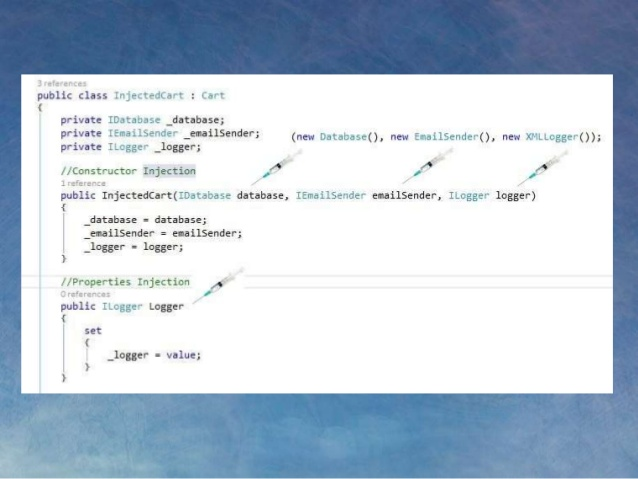

:memo: <span style="color:orange">ANDROID_ADVANCED_005_ARCHITECTURE</span>
# ARCHITECTURE


## Table of Content

- [ARCHITECTURE](#architecture)
  - [Table of Content](#table-of-content)
  - [I. SOLID, KISS, DRY](#i-solid-kiss-dry)
  - [II. Dependency injection, Manual DI](#ii-dependency-injection-manual-di)
  - [III. Clean architecture](#iii-clean-architecture)
  - [IV. Modularization](#iv-modularization)

## I. SOLID, KISS, DRY

Đây là ba nguyên tắc quan trọng trong phát triển phần mềm giúp viết code sạch, dễ bảo trì và mở rộng.

**1. SOLID:**

SOLID là một tập hợp 5 nguyên tắc thiết kế hướng đối tượng, giúp tạo ra các ứng dụng dễ dàng bảo trì và mở rộng.

- **S - Single Responsibility Principle (Nguyên tắc đơn trách nhiệm):**  Một class chỉ nên có một lý do để thay đổi.  Nói cách khác, mỗi class chỉ nên chịu trách nhiệm về một chức năng cụ thể.
- **O - Open/Closed Principle (Nguyên tắc mở/đóng):**  Các class nên mở để mở rộng (extension) nhưng đóng để sửa đổi (modification).  Bạn nên có thể thêm chức năng mới mà không cần sửa đổi code hiện có.
- **L - Liskov Substitution Principle (Nguyên tắc thay thế Liskov):**  Các đối tượng của class con phải có thể thay thế các đối tượng của class cha mà không làm thay đổi tính đúng đắn của chương trình.
- **I - Interface Segregation Principle (Nguyên tắc phân tách interface):**  Nhiều interface cụ thể (client-specific interfaces) tốt hơn một interface tổng quát (general-purpose interface).  Không nên ép một class phải implement các phương thức mà nó không sử dụng.
- **D - Dependency Inversion Principle (Nguyên tắc đảo ngược phụ thuộc):**  Các module cấp cao không nên phụ thuộc vào các module cấp thấp. Cả hai nên phụ thuộc vào các abstraction.  Abstractions không nên phụ thuộc vào chi tiết. Chi tiết nên phụ thuộc vào abstractions.

**2. KISS (Keep It Stupid Simple - Giữ cho nó đơn giản và ngu ngốc):**

Nguyên tắc KISS khuyến khích giữ cho code đơn giản và dễ hiểu.  Tránh code phức tạp không cần thiết.  Code đơn giản dễ dàng debug, bảo trì và mở rộng hơn.

**3. DRY (Don't Repeat Yourself - Không lặp lại chính mình):**

Nguyên tắc DRY khuyến khích tránh lặp lại code.  Nếu bạn thấy mình viết cùng một đoạn code nhiều lần, hãy tìm cách rút trích nó thành một hàm hoặc một class riêng biệt.  Việc này giúp giảm thiểu lỗi, dễ dàng bảo trì và cập nhật code.

**Ví dụ về việc áp dụng SOLID, KISS và DRY:**

Giả sử bạn đang viết một ứng dụng xử lý các hình dạng khác nhau.  Thay vì viết một class lớn xử lý tất cả các hình dạng, bạn có thể áp dụng SOLID và tạo các class riêng biệt cho từng hình dạng (ví dụ: `Circle`, `Square`, `Rectangle`).  Mỗi class này sẽ implement một interface chung (ví dụ: `Shape`).  Điều này tuân theo nguyên tắc Single Responsibility và Open/Closed.  Bạn cũng có thể sử dụng Dependency Inversion bằng cách inject `Shape` vào các class khác, thay vì phụ thuộc trực tiếp vào các class cụ thể như `Circle` hay `Square`.  Áp dụng KISS bằng cách giữ cho code trong mỗi class đơn giản và dễ hiểu.  Áp dụng DRY bằng cách rút trích các logic chung (ví dụ: tính diện tích) thành các hàm helper hoặc class utility.

Bằng cách áp dụng SOLID, KISS và DRY, bạn có thể viết code sạch hơn, dễ bảo trì hơn, và dễ dàng mở rộng hơn.

## II. Dependency injection, Manual DI

> Có thể hiểu Dependency Injection một cách đơn giản như sau:Các module không giao tiếp trực tiếp với nhau, mà thông qua interface. Module cấp thấp sẽ implement interface, module cấp cao sẽ gọi module cấp thấp thông qua interface.

- Ví dụ: Để giao tiếp với database, ta có interface IDatabase, các module cấp thấp là XMLDatabase, SQLDatabase. Module cấp cao là CustomerBusiness sẽ chỉ sử dụng interface IDatabase.
Việc khởi tạo các module cấp thấp sẽ do DI Container thực hiện. Ví dụ: Trong module CustomerBusiness, ta sẽ không khởi tạo IDatabase db = new XMLDatabase(), việc này sẽ do DI Container thực hiện. Module CustomerBusiness sẽ không biết gì về module XMLDatabase hay SQLDatabase.
Việc Module nào gắn với interface nào sẽ được config trong code hoặc trong file XML.
DI được dùng để làm giảm sự phụ thuộc giữa các module, dễ dàng hơn trong việc thay đổi module, bảo trì code và testing.

- Các dạng DI
- Có 3 dạng Dependency Injection:

Constructor Injection: Các dependency sẽ được container truyền vào (inject vào) 1 class thông qua constructor của class đó. Đây là cách thông dụng nhất.
Setter Injection: Các dependency sẽ được truyền vào 1 class thông qua các hàm Setter.
Interface Injection: Class cần inject sẽ implement 1 interface. Interface này chứa 1 hàm tên Inject. Container sẽ injection dependency vào 1 class thông qua việc gọi hàm Inject của interface đó. Đây là cách rườm rà và ít được sử dụng nhất.

- Ưu điểm và khuyết điểm của DI
Dĩ nhiên, DI không phải vạn năng, nó cũng có những ưu điểm và khuyết điểm, do đó không phải project nào cũng nên áp dụng DI. Với những dự án lớn, code nhiều, DI là thứ rất cần thiết để đảm bảo code dễ bảo trì, dễ thay đổi. Vì vậy, bản thân các framework nổi tiếng như Spring, Struts2, ASP.NET MVC, … đều hỗ trợ hoặc tích hợp sẵn DI. ASP.NET MVC từ bản 5 trở xuống cho phép ta sử dụng DI container từ thư viện, từ bản 6 thì tích hợp sẵn DI luôn, không cần phải thêm thư viện gì.

| Ưu điểm  |  Khuyết điểm |
|---|---|
|Giảm sự kết dính giữa các module |Khái niệm DI khá “khó tiêu”, các developer mới sẽ gặp khó khăn khi học |
|Code dễ bảo trì, dễ thay thế module | Sử dụng interface nên đôi khi sẽ khó debug, do không biết chính xác module nào được gọi|
|Rất dễ test và viết Unit Test |Các object được khởi tạo toàn bộ ngay từ đầu, có thể làm giảm performance |
|Dễ dàng thấy quan hệ giữa các module (Vì các dependecy đều được inject vào constructor) | Làm tăng độ phức tạp của code|

- Dependency là gì?
Dependency là những module cấp thấp, hoặc cái service gọi từ bên ngoài. Với cách code thông thường, các module cấp cao sẽ gọi các module cấp thấp. Module cấp cao sẽ phụ thuộc và module cấp thấp, điều đó tạo ra các dependency.

- Ví dụ: 

Hàm này sẽ lưu order xuống database và gửi email cho user. Class Cart sẽ khởi tạo và gọi module Database, module EmailSender, module Logger, các module này chính là các dependency.

```java
public class Cart
{
    public void Checkout(int orderId, int userId)
    {
        Database db = new Database();
        db.Save(orderId);
 
        Logger log = new Logger();
        log.LogInfo("Order has been checkout");
 
        EmailSender es = new EmailSender();
        es.SendEmail(userId);
    }
}
```

- Cách làm này có gì sai không? Có vẻ là không, viết code cũng nhanh nữa. Nhưng cách viết này “có thể” sẽ dẫn tới một số vấn đề trong tương lai:

Rất khó test hàm Checkout này, vì nó dính dáng tới cả hai module Database và EmailSender.
Trong trường hợp ta muốn thay đổi module Database, EmailSender,… ta phải sửa toàn bộ các chỗ khởi tạo và gọi các module này. Việc làm này rất mất thời gian, dễ gây lỗi.
Về lâu dài, code sẽ trở nên “kết dính”, các module có tính kết dính cao, một module thay đổi sẽ kéo theo hàng loạt thay đổi. Đây là nỗi ác mộng khi phải maintainance code.
Inversion of Control và Dependency Injection đã ra đời để giải quyết những vấn đề này.

- Để các module không “kết dính” với nhau, chúng không được kết nối trực tiếp, mà phải thông qua interface. Đó cũng là nguyên lý cuối cùng trong SOLID.
- Ta lần lượt tạo các interface IDatabase, IEmailSender, ILogger, các class kia ban đầu sẽ lần lượt kế thừa những interface này.

```java 
// Interface
public interface IDatabase
{
    void Save(int orderId);
}
 
public interface ILogger
{
    void LogInfo(string info);
}
 
public interface IEmailSender
{
    void SendEmail(int userId);
}
 
// Các Module implement các Interface
public class Logger : ILogger
{
    public void LogInfo(string info)
    {
        //...
    }
}
 
public class Database : IDatabase
{
    public void Save(int orderId)
    {
        //...
    }
}
 
public class EmailSender : IEmailSender
{
    public void SendEmail(int userId)
    {
        //...
    }
}
```

- Hàm Checkout mới:

```java
public void Checkout(int orderId, int userId)
{
    // Nếu muốn thay đổi database, ta chỉ cần thay dòng code dưới
    // Các Module XMLDatabase, SQLDatabase phải implement IDatabase
    //IDatabase db = new XMLDatabase(); 
    //IDatebase db = new SQLDatabase();
    IDatabase db = new Database();
    db.Save(orderId);
 
    ILogger log = new Logger();
    log.LogInfo("Order has been checkout");
 
    IEmailSender es = new EmailSender();
    es.SendEmail(userId);
}
```

- Với interface, ta có thể dễ dàng thay đổi, swap các module cấp thấp mà không ảnh hưởng tới module Cart. Đây là bước đầu của IoC.

- Để dễ quản lý, ta có thể bỏ tất cả những hàm khởi tạo module vào constructor của class Cart.

```java
public class Cart
{
    private readonly IDatabase _db;
    private readonly ILogger _log;
    private readonly IEmailSender _es;
 
    public Cart()
    {
        _db = new Database();
        _log = new Logger();
        _es = new EmailSender();
    }
 
    public void Checkout(int orderId, int userId)
    {
        _db.Save(orderId);
        _log.LogInfo("Order has been checkout");
        _es.SendEmail(userId);
    }
}
```

- Cách này thoạt nhìn khá khá ổn. Tuy nhiên, nếu có nhiều module khác cần dùng tới Logger, Database, ta lại phải khởi tạo các Module con ở constructor của module đó.

- Dependency Injection giải quyết được vấn đề này. Các Module cấp thấp sẽ được inject (truyền vào) vào Module cấp cao thông qua Constructor hoặc thông qua Properties. Nói một cách đơn giản dễ hiểu về DI:

- Ta không gọi toán tử new để khởi tạo instance, mà instance đó sẽ được truyền từ ngoài vào (Truyền manual, hoặc nhờ DI Container).



- Sau khi áp dụng Dependency Injection, ta sẽ sử dụng class Cart như sau:

```java
public Cart(IDatabase db, ILogger log, IEmailSender es)
    {
            _db = db;
            _log = log;
            _es = es;
     }

     //Dependency Injection một cách đơn giản nhất
     Cart myCart = new Cart(new Database(),
                       new Logger(), new EmailSender());
     //Khi cần thay đổi database, logger
     myCart = new Cart(new XMLDatabase(),
                  new FakeLogger(), new FakeEmailSender());
```

- Ta sử dụng DI Container. Chỉ việc define một lần, DI Container sẽ tự thực hiện việc inject các module cấp thấp vào module cấp cao.

```java
//Với mỗi Interface, ta define một Module tương ứng
DIContainer.SetModule<IDatabase, Database>();
DIContainer.SetModule<ILogger, Logger>();
DIContainer.SetModule<IEmailSender, EmailSender>();
 
DIContainer.SetModule<Cart, Cart>();
 
//DI Container sẽ tự inject Database, Logger vào Cart
var myCart = DIContainer.GetModule(); 
 
//Khi cần thay đổi, ta chỉ cần sửa code define
DIContainer.SetModule<IDatabase, XMLDatabase>();
```

## III. Clean architecture

Clean Architecture là một kiến trúc phần mềm được đề xuất bởi Robert C. Martin (Uncle Bob) nhằm tạo ra các ứng dụng dễ dàng bảo trì, kiểm thử và độc lập với các framework, UI, database và bất kỳ tác nhân bên ngoài nào.

**Nguyên tắc cốt lõi:**

- **Độc lập với Frameworks:** Kiến trúc không phụ thuộc vào sự tồn tại của bất kỳ thư viện nào. Điều này cho phép bạn sử dụng các framework như công cụ, chứ không phải là ràng buộc ứng dụng của bạn với chúng.
- **Testable:** Logic nghiệp vụ có thể được kiểm thử mà không cần UI, database, web server hoặc bất kỳ tác nhân bên ngoài nào khác.
- **Độc lập với UI:** UI có thể dễ dàng thay đổi mà không ảnh hưởng đến phần còn lại của hệ thống. Bạn có thể thay đổi từ web sang mobile mà không cần sửa đổi logic nghiệp vụ.
- **Độc lập với Database:** Logic nghiệp vụ không bị ràng buộc với bất kỳ cơ sở dữ liệu cụ thể nào. Bạn có thể chuyển đổi giữa SQL, NoSQL hoặc bất kỳ cơ chế lưu trữ dữ liệu nào khác mà không ảnh hưởng đến logic nghiệp vụ.
- **Độc lập với bất kỳ tác nhân bên ngoài nào:** Logic nghiệp vụ được cô lập với thế giới bên ngoài.

**Cấu trúc của Clean Architecture:**

Clean Architecture được tổ chức thành các lớp đồng tâm, với các dependency chỉ hướng vào trong. Các lớp bên ngoài phụ thuộc vào các lớp bên trong, nhưng không ngược lại.

- **Entities:** Chứa các đối tượng nghiệp vụ cốt lõi của ứng dụng. Chúng đại diện cho các khái niệm và quy tắc nghiệp vụ bất biến.
- **Use Cases:** Chứa logic ứng dụng cụ thể, thao tác trên các Entities. Chúng đại diện cho các hành động mà người dùng có thể thực hiện trong ứng dụng.
- **Interface Adapters:** Chứa các lớp chuyển đổi dữ liệu giữa các use case và các framework hoặc trình điều khiển bên ngoài (ví dụ: Presenters, Controllers, Gateways).
- **Frameworks and Drivers:** Lớp ngoài cùng, chứa các chi tiết cụ thể về framework, UI, database, web, v.v. (ví dụ: Android UI, Web Framework, Database).

**Lợi ích của Clean Architecture:**

- **Dễ bảo trì:** Việc thay đổi một phần của ứng dụng không ảnh hưởng đến các phần khác.
- **Dễ kiểm thử:** Các thành phần có thể được kiểm thử độc lập.
- **Linh hoạt:** Dễ dàng thích ứng với các thay đổi trong yêu cầu.
- **Code rõ ràng và dễ hiểu:** Cấu trúc lớp rõ ràng giúp code dễ đọc và dễ hiểu hơn.

**Nhược điểm:**

- **Phức tạp hơn:** Cần nhiều lớp và interface hơn so với các kiến trúc đơn giản hơn.
- **Khó khăn ban đầu:** Có thể mất thời gian để làm quen với kiến trúc.

**Kết luận:**

Clean Architecture là một kiến trúc mạnh mẽ giúp tạo ra các ứng dụng chất lượng cao, dễ bảo trì và kiểm thử. Mặc dù có độ phức tạp ban đầu, nhưng lợi ích lâu dài mà nó mang lại là rất đáng kể.

## IV. Modularization

- Modularization là một kỹ thuật quan trọng trong phát triển phần mềm, đặc biệt là đối với các ứng dụng lớn và phức tạp. Nó liên quan đến việc chia nhỏ một ứng dụng thành các module độc lập, có thể quản lý và bảo trì riêng biệt.

**Lợi ích của Modularization:**

- **Khả năng bảo trì được cải thiện (Improved Maintainability):** Các module nhỏ hơn, tập trung vào một chức năng cụ thể, dễ dàng hiểu, sửa đổi và debug hơn so với một khối code lớn.
- **Tái sử dụng code (Code Reusability):** Các module có thể được tái sử dụng trong các phần khác của ứng dụng hoặc trong các dự án khác.
- **Quản lý dependency rõ ràng (Clear Dependency Management):** Modularization giúp quản lý dependencies giữa các thành phần của ứng dụng một cách rõ ràng và hiệu quả hơn.
- **Build nhanh hơn (Faster Build Times):** Chỉ cần rebuild các module bị thay đổi, thay vì rebuild toàn bộ ứng dụng.
- **Làm việc nhóm hiệu quả hơn (Better Team Collaboration):** Các nhóm khác nhau có thể làm việc trên các module khác nhau một cách độc lập.
- **Kiểm thử dễ dàng hơn (Easier Testing):** Các module nhỏ hơn, dễ dàng viết unit test và integration test hơn.
- **Scalability:** Dễ dàng mở rộng ứng dụng bằng cách thêm các module mới.
- **Tách biệt mối quan tâm (Separation of Concerns):** Mỗi module tập trung vào một nhiệm vụ cụ thể, giúp code dễ hiểu và bảo trì hơn.

**Cách thực hiện Modularization:**

- **Phân tích ứng dụng:** Xác định các chức năng chính của ứng dụng và cách chia chúng thành các module.
- **Tạo các module:** Tạo các module riêng biệt cho từng chức năng.
- **Định nghĩa interface:** Định nghĩa các interface để giao tiếp giữa các module.
- **Quản lý dependencies:** Sử dụng một hệ thống quản lý dependencies (như Gradle, Maven) để quản lý dependencies giữa các module.
- **Tích hợp các module:** Kết hợp các module lại với nhau để tạo thành ứng dụng hoàn chỉnh.

**Ví dụ (Android):**

Trong Android, bạn có thể chia ứng dụng thành các module như:

- **Module `app`:** Module chính, chứa code liên quan đến UI và logic nghiệp vụ chính.
- **Module `features`:** Chứa các module tính năng riêng biệt, ví dụ: `feature_login`, `feature_profile`, `feature_home`.
- **Module `data`:** Chứa code liên quan đến truy cập dữ liệu (database, network).
- **Module `common`:** Chứa các utilities, helper functions, và các thành phần được sử dụng chung bởi các module khác.

**Modularization và các kỹ thuật khác:**

Modularization thường được kết hợp với các kỹ thuật khác như Dependency Injection (DI) để tăng tính linh hoạt và khả năng tái sử dụng của code.

**Kết luận:**

Modularization là một kỹ thuật quan trọng giúp cải thiện chất lượng và khả năng bảo trì của ứng dụng. Nó đặc biệt hữu ích cho các ứng dụng lớn và phức tạp. Bằng cách chia nhỏ ứng dụng thành các module độc lập, bạn có thể làm cho code dễ hiểu hơn, dễ dàng tái sử dụng hơn, và dễ dàng test hơn.
