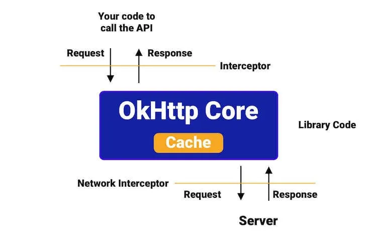
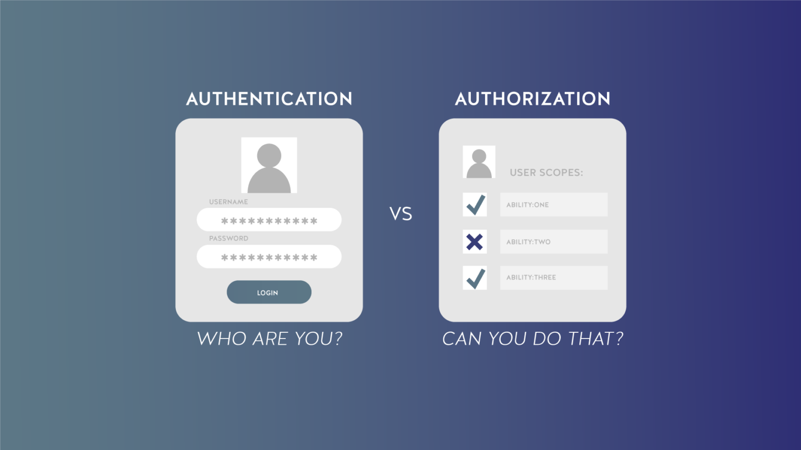

:memo: <span style="color:orange">ANDROID_ADVANCED_004_CALL_API</span>

# CALL API


## Table of Content

- [CALL API](#call-api)
  - [Table of Content](#table-of-content)
  - [I. Intercepter](#i-intercepter)
    - [1. Khái niệm](#1-khái-niệm)
    - [2. Phân loại](#2-phân-loại)
  - [II. Authentication và Authorization](#ii-authentication-và-authorization)
    - [1. Giới thiệu về Authentication và Authorization](#1-giới-thiệu-về-authentication-và-authorization)
    - [2. Phân biệt](#2-phân-biệt)
  - [III. Access Token, Refresh Token và Bearer Token](#iii-access-token-refresh-token-và-bearer-token)
    - [1. Access Token](#1-access-token)
    - [2. Refresh Token](#2-refresh-token)
  - [3. Bearer Token](#3-bearer-token)
    - [4. Bảng so sánh](#4-bảng-so-sánh)
    - [5. Các lợi ích chính:](#5-các-lợi-ích-chính)
  - [IV. Retrofit/OkHttp và Ktor Client](#iv-retrofitokhttp-và-ktor-client)
  - [**1. Cấu hình và sử dụng Retrofit/OkHttp**](#1-cấu-hình-và-sử-dụng-retrofitokhttp)
    - [**Cấu hình Retrofit với OkHttp**](#cấu-hình-retrofit-với-okhttp)
      - [**1.1. Thêm phụ thuộc vào `build.gradle.kts`:**](#11-thêm-phụ-thuộc-vào-buildgradlekts)
      - [**1.2. Tạo API Interface**](#12-tạo-api-interface)
      - [**1.3. Tích hợp OkHttp Interceptor với Retrofit**](#13-tích-hợp-okhttp-interceptor-với-retrofit)
      - [**1.4. Sử dụng Retrofit để gọi API**](#14-sử-dụng-retrofit-để-gọi-api)
  - [**2. Cấu hình và sử dụng Ktor Client**](#2-cấu-hình-và-sử-dụng-ktor-client)
    - [**Cấu hình Ktor Client**](#cấu-hình-ktor-client)
      - [**2.1. Thêm phụ thuộc vào `build.gradle.kts`:**](#21-thêm-phụ-thuộc-vào-buildgradlekts)
      - [**2.2. Tạo và cấu hình Ktor Client**](#22-tạo-và-cấu-hình-ktor-client)
      - [**2.3. Gọi API với Ktor Client**](#23-gọi-api-với-ktor-client)
  - [**3. Kết hợp OkHttp Interceptors**](#3-kết-hợp-okhttp-interceptors)
    - [**3.1. Custom Interceptor**](#31-custom-interceptor)
    - [**3.2. Tích hợp Interceptor vào OkHttpClient**](#32-tích-hợp-interceptor-vào-okhttpclient)
    - [**3.3. Tích hợp OkHttpClient vào Retrofit**](#33-tích-hợp-okhttpclient-vào-retrofit)

## I. Intercepter

### 1. Khái niệm

> OkHttp Interceptors trong Android là công cụ mạnh mẽ cho phép chặn và sửa đổi các yêu cầu và phản hồi HTTP.

- Chúng cung cấp một cách linh hoạt để tùy chỉnh hành vi mạng, thêm tiêu đề tùy chỉnh, ghi nhật ký yêu cầu và phản hồi, triển khai cơ chế xác thực và thực hiện các tác vụ liên quan đến mạng khác.



- Nói một cách đơn giản, Interceptor giống như nhân viên an ninh trong quá trình kiểm tra an ninh tại Sân bay. Họ kiểm tra thẻ lên máy bay, đóng dấu vào đó và sau đó cho phép chúng đi qua.

### 2. Phân loại

- Application Interceptor: 
  - Đây là những interceptor được thêm vào giữa Application Code và OkHttp Core Library. 
  - Đây là những interceptor mà chúng tata thêm vào bằng cách sử dụng `addInterceptor()`.
  - Được thực thi trước khi yêu cầu được gửi đi và sau khi nhận được phản hồi.
  - Được thực thi một lần trên tất cả các yêu cầu.
  - Thường dùng để:
    - Thêm header chung cho tất cả request (ví dụ: auth token)
    - Log request/response
    - Thay đổi request trước khi gửi đi
    - Xử lý response trước khi trả về app

- Network Interceptor: 
  - Đây là các interceptor được thêm vào giữa OkHttp Core Library và Server. 
  - Chúng có thể được thêm vào OkHttpClient bằng cách sử dụng `addNetworkInterceptor()`.
  - Được thực thi sau khi yêu cầu được gửi đi và trước khi phản hồi được trả về từ mạng. Nó có thể can thiệp vào giao tiếp mạng.
  - Thường dùng để:
    - Theo dõi metrics mạng
    - Rewrite request compressed
    - Quản lý cache ở tầng network
    - Thêm, sửa đổi header liên quan đến network


```kotlin
// Application Interceptor
val appInterceptor = Interceptor { chain ->
    val request = chain.request().newBuilder()
        .addHeader("Authorization", "Bearer token")
        .build()
    chain.proceed(request)  
}

// Network Interceptor 
val networkInterceptor = Interceptor { chain ->
    val request = chain.request()
    val response = chain.proceed(request)
    // Log network metrics
    println("Network time: ${response.receivedResponseAtMillis - response.sentRequestAtMillis}")
    response
}

// Thêm vào OkHttpClient
val client = OkHttpClient.Builder()
    .addInterceptor(appInterceptor)         // Application interceptor
    .addNetworkInterceptor(networkInterceptor) // Network interceptor 
    .build()
```

- Sự khác biệt chính:
    - Thứ tự thực thi: Application -> Cache -> Network Interceptor
    - Số lần gọi: Application gọi 1 lần/request, Network gọi nhiều lần nếu có redirect/retry
    - Khả năng truy cập: Network có thể thấy nhiều thông tin network hơn
    - Mục đích sử dụng: Application tập trung vào logic ứng dụng, Network tập trung vào xử lý network

## II. Authentication và Authorization



### 1. Giới thiệu về Authentication và Authorization

- Authentication là gì? Authentication (tạm dịch: xác thực)  là quá trình kiểm tra danh tính một tài khoản đang vào hệ thống hiện tại thông qua một hệ thống xác thực.

- Đây là bước ban đầu của mọi hệ thống có yêu cầu về nhận biết người dùng hoặc có yêu cầu lưu trữ các hành động cá nhận hoá của từng người dùng riêng. Hiểu đơn giản, Authentication là quá trình đi tìm câu trả lời cho câu hỏi “Bạn là ai?”

- Authorization là quá trình để xác định người dùng có được xác thực có quyền truy cập vào các tài nguyên cụ thể hay không. Nó xác minh quyền của bạn để cấp cho bạn quyền truy cập vào các tài nguyên như thông tin, cơ sở dữ liệu, file,…

- Authorization thường được đưa ra sau khi xác thực xác nhận các đặc quyền thực hiện của bạn. Nói một cách đơn giản hơn, nó giống như cho phép ai đó chính thức làm điều gì đó hoặc bất cứ điều gì.

### 2. Phân biệt

- Khi vào một tòa nhà:
  - Authentication: Bảo vệ kiểm tra thẻ nhân viên để xác định bạn là ai
  - Authorization: Thẻ của bạn chỉ cho phép vào một số tầng nhất định

- Trong hệ thống phần mềm:
  - Authentication: Đăng nhập bằng email/password
  - Authorization: Kiểm tra role để xác định có quyền thực hiện chức năng hay không

Dưới đây là bảng Markdown so sánh chi tiết giữa Authentication và Authorization:

| Tiêu chí         | Authentication                                                               | Authorization                                               |
| ---------------- | ---------------------------------------------------------------------------- | ----------------------------------------------------------- |
| Định nghĩa       | Xác minh một người thực sự là ai                                             | Xác định người dùng được phép làm gì                        |
| Mục đích         | Xác thực danh tính người dùng                                                | Cấp và kiểm soát quyền truy cập                             |
| Thứ tự thực hiện | Thực hiện đầu tiên                                                           | Thực hiện sau Authentication                                |
| Input            | Thông tin xác thực (credentials) như username/password, sinh trắc học, token | Thông tin về quyền, vai trò, chính sách                     |
| Output           | Trả về thông tin định danh hoặc token xác thực                               | Trả về danh sách quyền hoặc true/false cho một quyền cụ thể |
| Phương thức      | Username/password, 2FA, biometric, certificates, tokens                      | RBAC, ABAC, ACL, OAuth scopes, JWT claims                   |
| Tính tùy biến    | Hạn chế, thường tuân theo các chuẩn bảo mật                                  | Linh hoạt, có thể tùy chỉnh theo yêu cầu nghiệp vụ          |
| Thông báo lỗi    | "Invalid credentials", "Account locked"                                      | "Access denied", "Insufficient permissions"                 |
| Quá trình xử lý  | So sánh thông tin xác thực với dữ liệu lưu trữ                               | Kiểm tra quyền truy cập dựa trên vai trò/policy             |
| Phạm vi áp dụng  | Toàn bộ ứng dụng/hệ thống                                                    | Từng chức năng/tài nguyên cụ thể                            |

## III. Access Token, Refresh Token và Bearer Token

### 1. Access Token

- Định nghĩa: Là một chuỗi ký tự mã hóa đại diện cho quyền truy cập của người dùng
- Đặc điểm:
  - Short-lived token (15-30 phút hoặc vài giờ)
  - Stateless - server không cần lưu trữ
  - Có thể tự xác thực mà không cần check database
  - Chứa thông tin người dùng và quyền (claims)
  - Không thể thu hồi trước khi hết hạn (trừ khi dùng blacklist)

### 2. Refresh Token

- Định nghĩa: Token dài hạn dùng để lấy Access Token mới khi token cũ hết hạn
- Đặc điểm:
  - Long-lived token (vài ngày đến vài tháng)
  - Được lưu trữ trong database ở phía server
  - Có thể thu hồi bất cứ lúc nào
  - Thường là một chuỗi ngẫu nhiên
  - Chỉ dùng để gọi endpoint refresh token
  - Phải được bảo vệ cẩn thận vì có thời gian sống dài

## 3. Bearer Token

- Là một loại token authorization
- "Bearer" nghĩa là "người mang token" - ai có token thì có quyền truy cập
- Được gửi trong HTTP header theo format: `Authorization: Bearer <token>`
- Access Token thường được sử dụng như một Bearer Token
- Cần được bảo vệ vì bất kỳ ai có token đều có thể sử dụng


### 4. Bảng so sánh

| Tiêu chí        | Access Token                  | Refresh Token        | Bearer Token              |
| --------------- | ----------------------------- | -------------------- | ------------------------- |
| Mục đích        | Xác thực và ủy quyền truy cập | Lấy Access Token mới | Xác thực người mang token |
| Thời gian sống  | Ngắn (phút/giờ)               | Dài (ngày/tháng)     | Tùy loại token            |
| Phạm vi sử dụng | Truy cập tài nguyên           | Chỉ dùng để refresh  | Truy cập tài nguyên       |
| Lưu trữ         | Memory/Session storage        | Secure storage       | Tùy loại token            |
| Format phổ biến | JWT                           | Opaque token         | JWT/Opaque                |

### 5. Các lợi ích chính:

- Bảo mật cao với token ngắn hạn
- Trải nghiệm user tốt với auto refresh
- Dễ mở rộng và tích hợp
- Phù hợp với kiến trúc phân tán
- Giảm tải cho database
- Dễ quản lý phiên đăng nhập

- Ví dụ: 
  - Xác thực ứng dụng mobile:
    - Sau khi user đăng nhập thành công, server trả về cả access token và refresh token
    - Access token được lưu trong memory/session để gọi API
    - Refresh token được lưu an toàn trong secure storage
    - Mỗi request đều gửi kèm access token trong header
    - Khi access token hết hạn, app tự động dùng refresh token để lấy cặp token mới
  - Nếu refresh token cũng hết hạn, yêu cầu user đăng nhập lại

## IV. Retrofit/OkHttp và Ktor Client

## **1. Cấu hình và sử dụng Retrofit/OkHttp**

### **Cấu hình Retrofit với OkHttp**
#### **1.1. Thêm phụ thuộc vào `build.gradle.kts`:**
```kotlin
implementation("com.squareup.retrofit2:retrofit:2.9.0")
implementation("com.squareup.retrofit2:converter-gson:2.9.0") // Dùng Gson để chuyển đổi JSON
implementation("com.squareup.okhttp3:okhttp:4.11.0")
implementation("com.squareup.okhttp3:logging-interceptor:4.11.0") // Logging Interceptor
```

#### **1.2. Tạo API Interface**
Sử dụng annotation như `@GET`, `@POST` để định nghĩa các endpoint của API.
```kotlin
import retrofit2.http.GET
import retrofit2.http.Query

interface ApiService {
    @GET("users")
    suspend fun getUsers(
        @Query("page") page: Int
    ): ApiResponse<List<User>>
}
```

#### **1.3. Tích hợp OkHttp Interceptor với Retrofit**
Interceptor được sử dụng để:
- **Thêm header toàn cục**: như `Authorization` hoặc `User-Agent`.
- **Ghi log request/response**.

**Ví dụ: Thêm Interceptor và cấu hình Retrofit**
```kotlin
import okhttp3.OkHttpClient
import okhttp3.logging.HttpLoggingInterceptor
import retrofit2.Retrofit
import retrofit2.converter.gson.GsonConverterFactory

object RetrofitInstance {

    private const val BASE_URL = "https://api.example.com/"

    // Logging Interceptor để ghi log request/response
    private val loggingInterceptor = HttpLoggingInterceptor().apply {
        level = HttpLoggingInterceptor.Level.BODY
    }

    // Custom Interceptor để thêm Authorization header
    private val authInterceptor = okhttp3.Interceptor { chain ->
        val request = chain.request().newBuilder()
            .addHeader("Authorization", "Bearer your_token")
            .build()
        chain.proceed(request)
    }

    // Tạo OkHttpClient
    private val okHttpClient = OkHttpClient.Builder()
        .addInterceptor(authInterceptor)
        .addInterceptor(loggingInterceptor)
        .build()

    // Tạo Retrofit Instance
    val retrofit: Retrofit = Retrofit.Builder()
        .baseUrl(BASE_URL)
        .client(okHttpClient)
        .addConverterFactory(GsonConverterFactory.create()) // Chuyển đổi JSON sang Object
        .build()

    val api: ApiService = retrofit.create(ApiService::class.java)
}
```

#### **1.4. Sử dụng Retrofit để gọi API**
```kotlin
class MainViewModel : ViewModel() {
    private val api = RetrofitInstance.api

    fun fetchUsers() {
        viewModelScope.launch {
            try {
                val response = api.getUsers(page = 1)
                Log.d("MainViewModel", "Users: $response")
            } catch (e: Exception) {
                Log.e("MainViewModel", "Error: ${e.message}")
            }
        }
    }
}
```

---

## **2. Cấu hình và sử dụng Ktor Client**

### **Cấu hình Ktor Client**
#### **2.1. Thêm phụ thuộc vào `build.gradle.kts`:**
```kotlin
implementation("io.ktor:ktor-client-core:2.3.4") // Core Client
implementation("io.ktor:ktor-client-cio:2.3.4") // CIO Engine
implementation("io.ktor:ktor-client-logging:2.3.4") // Logging
implementation("io.ktor:ktor-client-content-negotiation:2.3.4") // Content Negotiation
implementation("io.ktor:ktor-serialization-gson:2.3.4") // Gson Serialization
```

#### **2.2. Tạo và cấu hình Ktor Client**
```kotlin
import io.ktor.client.*
import io.ktor.client.engine.cio.*
import io.ktor.client.plugins.contentnegotiation.*
import io.ktor.client.plugins.logging.*
import io.ktor.serialization.gson.*

object KtorClientInstance {

    val client = HttpClient(CIO) {
        // Logging Plugin
        install(Logging) {
            level = LogLevel.ALL
        }
        // Content Negotiation Plugin
        install(ContentNegotiation) {
            gson()
        }
    }
}
```

#### **2.3. Gọi API với Ktor Client**
```kotlin
import io.ktor.client.request.*
import io.ktor.client.statement.*

suspend fun fetchUsers() {
    val client = KtorClientInstance.client
    val response: String = client.get("https://api.example.com/users?page=1")
    println(response)
}
```

---

## **3. Kết hợp OkHttp Interceptors**

### **3.1. Custom Interceptor**
Tạo một Interceptor tùy chỉnh để thực hiện các hành động như retry logic, ghi log, hoặc thêm header.

**Ví dụ: Interceptor để retry request khi gặp lỗi**
```kotlin
import okhttp3.Interceptor
import okhttp3.Response
import java.io.IOException

class RetryInterceptor(private val maxRetry: Int) : Interceptor {
    override fun intercept(chain: Interceptor.Chain): Response {
        var request = chain.request()
        var response: Response? = null
        var attempt = 0

        while (attempt < maxRetry) {
            try {
                response = chain.proceed(request)
                if (response.isSuccessful) break
            } catch (e: IOException) {
                attempt++
                if (attempt == maxRetry) throw e
            }
        }
        return response ?: throw IOException("Request failed after $maxRetry retries")
    }
}
```

### **3.2. Tích hợp Interceptor vào OkHttpClient**
```kotlin
val okHttpClient = OkHttpClient.Builder()
    .addInterceptor(RetryInterceptor(3)) // Retry tối đa 3 lần
    .addInterceptor(loggingInterceptor)  // Ghi log request/response
    .build()
```

### **3.3. Tích hợp OkHttpClient vào Retrofit**
```kotlin
val retrofit = Retrofit.Builder()
    .baseUrl(BASE_URL)
    .client(okHttpClient) // Sử dụng OkHttpClient với RetryInterceptor
    .addConverterFactory(GsonConverterFactory.create())
    .build()
```
