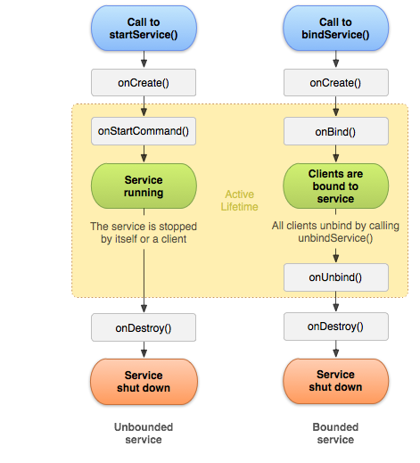

:memo: <span style="color:orange">ANDROID_ADVANCED_006_SERVICE</span>

# SERVICE AND BROADCASE RECEIVER


## Table of Content

- [SERVICE AND BROADCASE RECEIVER](#service-and-broadcase-receiver)
  - [Table of Content](#table-of-content)
  - [I. Service](#i-service)
    - [1. Khái niệm. Các loại Service](#1-khái-niệm-các-loại-service)
    - [2. Lifecycle của Service](#2-lifecycle-của-service)
    - [3. Phân biệt startService() và bindService()](#3-phân-biệt-startservice-và-bindservice)
  - [II. Broadcast Receiver](#ii-broadcast-receiver)
    - [1. Khái niệm](#1-khái-niệm)
    - [2 Cách đăng ký Broadcast](#2-cách-đăng-ký-broadcast)
    - [33. Phân biệt các loại Broadcast](#33-phân-biệt-các-loại-broadcast)
      - [Ordered Broadcast vs. Normal Broadcast](#ordered-broadcast-vs-normal-broadcast)
      - [Implicit Broadcasts vs. Explicit Broadcasts](#implicit-broadcasts-vs-explicit-broadcasts)
    - [4. Cấp quyền](#4-cấp-quyền)

## I. Service

### 1. Khái niệm. Các loại Service

> Service là một trong 4 component lớn của Android (Activity, Service, Broadcast Receiver, Content Provider).

- Một Service là một thành phần (component) có thể thực hiện các hoạt động lâu dài trong background và nó không cung cấp một giao diện người dùng.

- Một thành phần khác của ứng dụng có thể start nó, và nó tiếp tục chạy trong background ngay cả khi người dùng chuyển sang ứng dụng khác.

- Ngoài ra một thành phần có thể liên kết (bind) với một Service để tương tác với Service đó, thậm chí là thực hiện truyền thông liên tiến trình IPC (một hoạt động chia sẽ dữ liệu qua nhiều tiến trình).
- Ví dụ: một dịch vụ có thể xử lý các giao dịch mạng, phát nhạc, thực hiện I/O tệp hoặc tương tác với nhà cung cấp nội dung, tất cả đều ở chế độ nền.

:warninging: Dịch vụ chạy trong luồng chính của quy trình lưu trữ; dịch vụ không tạo luồng riêng và không chạy trong một quy trình riêng biệt trừ phi được chỉ định khác.

- Service được chia làm 3 loại khác nhau:
  - Foreground: thực hiện một số thao tác mà người dùng có thể nhận thấy.
    - Ví dụ: một ứng dụng âm thanh sẽ sử dụng Foreground service để phát một bản âm thanh.
    - Foreground service phải hiển thị một Thông báo để người dùng chủ động biết rằng dịch vụ đang chạy. Không thể đóng thông báo này trừ phi dịch vụ bị dừng hoặc bị xoá khỏi nền trước. Foreground service tiếp tục chạy ngay cả khi người dùng không tương tác với ứng dụng.
  - Background: thực hiện một thao tác mà người dùng không trực tiếp nhận thấy.
    - Ví dụ: nếu một ứng dụng sử dụng một dịch vụ để nén bộ nhớ, thì đó thường là một background service.
    - Từ API 26 trở lên (android 8.0), nên dùng WorkManager thay thế.
  - Bound: khi một thành phần ứng dụng liên kết với nó bằng cách gọi bindService().
    - Bound service cung cấp giao diện Client - Server cho phép các thành phần tương tác với dịch vụ, gửi yêu cầu, nhận kết quả và thậm chí thực hiện việc này trên các quy trình có giao tiếp giữa các quy trình (IPC).
    - Bound service chỉ chạy miễn là một thành phần ứng dụng khác được liên kết với dịch vụ đó. Nhiều thành phần có thể liên kết với dịch vụ cùng một lúc, nhưng khi tất cả các thành phần đó huỷ liên kết, dịch vụ sẽ bị huỷ.

- Dịch vụ chỉ đơn giản là một thành phần có thể chạy ở chế độ nền, ngay cả khi người dùng không tương tác với ứng dụng của bạn. Vì vậy chỉ nên tạo dịch vụ nếu đó là điều bạn cần. Còn nếu muốn thực hiện một công việc ngoài Main Thread khi có người dùng tương tác với ứng dụng thì bạn nên tạo ra một Thread mới.

- Độ ưu tiên: Hệ thống Android bắt buộc phải dừng một service khi bộ nhớ ít và phải khôi phục tài nguyên hệ thống cho Activity đang được sử dụng.
  - Bound > Foreground > Background

### 2. Lifecycle của Service



- onCreate()
  - Được gọi khi service được tạo lần đầu tiên
  - Chỉ được gọi một lần trong suốt vòng đời của service
  - Dùng để thiết lập các cấu hình ban đầu

- onStartCommand()
  - Được gọi khi service được bắt đầu bằng startService()
  - Có thể được gọi nhiều lần nếu service được start nhiều lần
  - Trả về giá trị chỉ định cách xử lý khi service bị hệ thống kill:
    - START_STICKY: Tự động tạo lại service
    - START_NOT_STICKY: Không tạo lại service
    - START_REDELIVER_INTENT: Tạo lại service và gửi lại intent cuối cùng

- onBind()
  - Được gọi khi một thành phần khác gọi bindService()
  - Trả về IBinder để giao tiếp với client
  - Nếu service không hỗ trợ binding, trả về null

- onUnbind()
  - Được gọi khi tất cả client đã ngắt kết nối

- onRebind()
  - Được gọi khi client mới kết nối sau khi onUnbind() đã được gọi

- onDestroy()
  - Được gọi khi service bị hủy
  - Dùng để giải phóng tài nguyên

- Một Started Service hay là Unbound Service là service được khởi động bằng phương thức startService() từ thành phần khác. Và nó sẽ tiếp tục chạy trong background kể cả khi thành phần khởi tạo nó bị phá hủy. Đây cũng là xem là một Background Service theo cách chia trên.

### 3. Phân biệt startService() và bindService()

- startService()
  - Khởi động service để chạy vô thời hạn cho đến khi service tự gọi stopSelf() hoặc một component khác gọi stopService()
  - Không cung cấp giao diện để tương tác với service
  - Service tiếp tục chạy ngay cả khi component khởi chạy đã bị hủy
  - Vòng đời: onCreate() → onStartCommand() → onDestroy()

  - Ứng dụng phù hợp:
    - Thực hiện các tác vụ nền không cần trả kết quả (tải file, phát nhạc...)
    - Tác vụ độc lập không yêu cầu tương tác với component khởi chạy

- bindService()
  - Tạo kết nối giữa component và service
  - Cho phép tương tác hai chiều thông qua interface (IBinder)
  - Service chỉ chạy khi có ít nhất một component đang kết nối với nó
  - Khi tất cả các component ngắt kết nối (unbind), service sẽ tự động bị hủy
  - Vòng đời: onCreate() → onBind() → onUnbind() → onDestroy()

  - Ứng dụng phù hợp:
    - Client-server interface: component cần thực hiện giao tiếp với service
    - Tác vụ cần theo dõi tiến độ, trả kết quả về component
    - Tác vụ phụ thuộc vào vòng đời của component khởi chạy

## II. Broadcast Receiver

### 1. Khái niệm

- **Broadcast Receiver** là một trong 4 component lớn trong Android, với mục đích là lắng nghe các sự kiện, trạng thái của hệ thống phát ra thông qua Intent nhờ đó mà các lập trình viên có thể xử lí được các sự kiện hệ thống ở bên trong ứng dụng của mình.
- **Broadcast Receiver** có thể hoạt động được cả khi ứng dụng bị tắt đi, nghĩa là ở background chính vì vậy nó thường được sử dụng với **service**.
- Ví dụ một số Broadcast từ hệ thống như thông báo rút cắm sạc , pin yếu , chế độ máy bay , khởi động máy ,... Không như activity , BroadcastReceiver không có giao diện , ta có thể truyền thông tin thông qua intent để đóng gói dữ liệu.

### 2 Cách đăng ký Broadcast

- Đăng ký trong file AndroidManifest:

```xml
<application
    android:allowBackup="true"
    android:icon="@mipmap/ic_launcher"
    android:label="@string/app_name"
    android:roundIcon="@mipmap/ic_launcher_round"
    android:supportsRtl="true"
    android:theme="@style/AppTheme">
    <activity android:name=".MainActivity">
        <intent-filter>
            <action android:name="android.intent.action.MAIN"/>

            <category android:name="android.intent.category.LAUNCHER"/>
        </intent-filter>
     </activity>

     <receiver android:name=".Broadcast">
         <intent-filter>
             <action android:name="android.intent.action.AIRPLANE_MODE"/>
         </intent-filter>
     </receiver>
</application>
```

- Ở đây trong thẻ <intent-filter> có sự kiện lắng nghe là <action android:name="android.intent.action.AIRPLANE_MODE"/> tương ứng với sự kiện bật tắt chế độ máy bay. Nếu không có action này thì chúng ta sẽ không nhận được bất kì thông báo nào khi có sự thay đổi.

- Xử lý kết quả trả về bằng cách tạo một class mới extends lại BroadcastReceiver

```java
public class Broadcast extends BroadcastReceiver {
            @Override
            public void onReceive(Context context, Intent intent) {
                Log.d(Broadcast.class.getSimpleName(), "Air Plane mode");
            }
        }
```

- Đăng ký bằng code:

```java
// Tạo receiver
BroadcastReceiver myReceiver = new BroadcastReceiver() {
    @Override
    public void onReceive(Context context, Intent intent) {
        // Xử lý broadcast
    }
};

// Đăng ký receiver
IntentFilter filter = new IntentFilter();
filter.addAction("android.intent.action.ACTION_POWER_CONNECTED");
registerReceiver(myReceiver, filter);

// Hủy đăng ký khi không cần
@Override
protected void onDestroy() {
    super.onDestroy();
    unregisterReceiver(myReceiver);
}
```

### 33. Phân biệt các loại Broadcast

#### Ordered Broadcast vs. Normal Broadcast

- Ordered Broadcast
  - Cơ chế: Gửi broadcast tuần tự theo thứ tự ưu tiên (priority)
  - Thứ tự nhận: Các receiver nhận broadcast lần lượt từ mức ưu tiên cao đến thấp
  - Thao tác: Mỗi receiver có thể xử lý dữ liệu, thay đổi kết quả, hoặc hủy broadcast
  - Truyền dữ liệu: Receiver có thể truyền dữ liệu cho receiver tiếp theo hoặc lưu kết quả cuối cùng
  - Hiệu suất: Chậm hơn so với Normal Broadcast do xử lý tuần tự
  - Cách gửi: Sử dụng sendOrderedBroadcast()

```java
javaCopyIntent intent = new Intent("ACTION_NAME");
sendOrderedBroadcast(intent, null, resultReceiver, null, 
                    Activity.RESULT_OK, initialData, null);
```

- Normal Broadcast

  - Cơ chế: Gửi broadcast đồng thời đến tất cả receiver
  - Thứ tự nhận: Không có thứ tự cụ thể, tất cả receiver nhận cùng lúc
  - Thao tác: Receiver không thể thay đổi dữ liệu hay hủy broadcast
  - Truyền dữ liệu: Không thể truyền dữ liệu giữa các receiver hoặc lưu kết quả
  - Hiệu suất: Nhanh hơn do xử lý đồng thời
  - Cách gửi: Sử dụng sendBroadcast()

```java
javaCopyIntent intent = new Intent("ACTION_NAME");
sendBroadcast(intent);
```

#### Implicit Broadcasts vs. Explicit Broadcasts

- Implicit Broadcasts
  - Đặc điểm: Không chỉ định receiver cụ thể
  - Cơ chế: Hệ thống xác định receiver dựa trên Intent Filter đã đăng ký
  - Phạm vi: Có thể được nhận bởi nhiều ứng dụng khác nhau
  - Khai báo: Receiver phải đăng ký Intent Filter trong AndroidManifest.xml hoặc đăng ký động
  - Giới hạn: Từ Android 8.0 (API 26), nhiều implicit broadcast bị hạn chế để tiết kiệm pin

```java
Intent intent = new Intent("com.example.ACTION_NAME");
sendBroadcast(intent);
```

- Explicit Broadcasts

  - Đặc điểm: Chỉ định chính xác component nhận broadcast
  - Cơ chế: Chỉ gửi đến receiver được chỉ định, bỏ qua Intent Filter
  - Phạm vi: Thường chỉ trong nội bộ ứng dụng hoặc giữa các ứng dụng đã biết trước
  - Bảo mật: An toàn hơn vì không thể bị chặn bởi ứng dụng khác
  - Khuyến nghị: Được khuyến khích sử dụng từ Android 8.0 trở lên

```java
Intent intent = new Intent(context, MyReceiver.class);
sendBroadcast(intent);
```

### 4. Cấp quyền

- Android 14
  - Tối ưu hóa việc gửi broadcast khi ứng dụng ở trạng thái cached
  - Các broadcast ít quan trọng (như ACTION_SCREEN_ON) bị trì hoãn cho đến khi ứng dụng trở lại trạng thái active
  - Các broadcast quan trọng vẫn được gửi đến cả ứng dụng ở trạng thái cached

- Android 9 (API 28)

  - NETWORK_STATE_CHANGED_ACTION không còn chứa thông tin về vị trí người dùng hoặc dữ liệu định danh cá nhân
  - Không còn nhận thông tin về SSID, BSSID, thông tin kết nối Wi-Fi từ broadcast
  - Thay thế: Sử dụng getConnectionInfo() để lấy thông tin này

  - Android 8.0 (API 26)

  - Hạn chế lớn về implicit broadcast với static receiver (khai báo trong AndroidManifest)
  - Ứng dụng target Android 8.0+ không thể sử dụng manifest để khai báo receiver cho hầu hết implicit broadcast
  - Giải pháp: Sử dụng context-registered receiver (đăng ký động) khi người dùng đang sử dụng ứng dụng

- Android 7.0 (API 24)

  - Ngừng gửi một số system broadcast:

    - ACTION_NEW_PICTURE
    - ACTION_NEW_VIDEO

  - CONNECTIVITY_ACTION chỉ có thể đăng ký thông qua registerReceiver(), không thể sử dụng manifest
